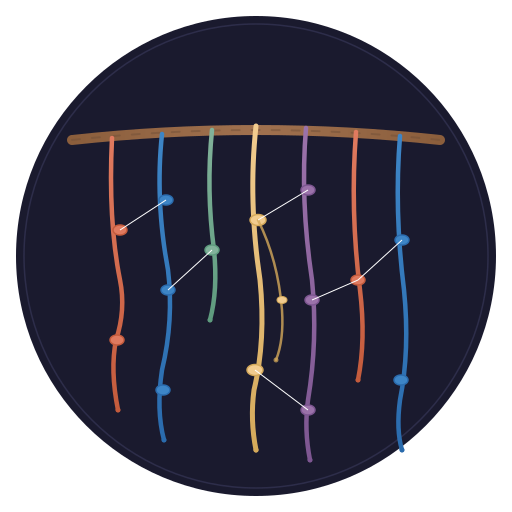

<p align="center">
  
</p>

<h1 align="center">quipu</h1>

<p align="center">
  <em>🪢 AI-native knowledge graph with strict ontology enforcement</em>
</p>

<p align="center">
  <a href="LICENSE"></a>
  <a href="https://www.rust-lang.org"></a>
  <a href="docs/book/src/SUMMARY.md"></a>
</p>

> *Cords are entities. Knots are facts. Colors are types. Agents are the readers.* 🧶

A [quipu](https://en.wikipedia.org/wiki/Quipu) is the Incan knotted-string recording system — a pre-Columbian knowledge graph encoded in textile. Trained readers (khipukamayuq) interpreted the structure. Quipu brings this philosophy to modern knowledge graphs: **strict structure, enforced by AI agents**.

## See It In Action

```text
$ quipu knot infrastructure.ttl --shapes aegis-schema.ttl --db ops.db
Ingested 847 triples in transaction 1 (SHACL: 0 violations)

$ quipu read "SELECT ?svc ?host WHERE {
    ?svc a <http://aegis.local/WebApplication> ;
         <http://aegis.local/runsOn> ?host .
  }" --db ops.db

| svc       | host   |
|-----------|--------|
| traefik   | kota   |
| forgejo   | koror  |
| grafana   | kota   |
3 results

$ quipu episode - --db ops.db <<'JSON'
{"name": "koror-rebuild", "source": "aegis/ellie",
 "nodes": [{"name": "koror", "type": "ProxmoxNode",
            "properties": {"status": "recovered"}}],
 "edges": [{"source": "koror", "target": "kota", "relation": "rebuilt_on"}]}
JSON
Ingested 6 triples in transaction 2
```

```text
$ quipu unravel --valid-at "2026-03-15T00:00:00Z" --db ops.db
# See the world as it was two weeks ago

$ quipu stats --db ops.db
Facts: 853 | Entities: 127 | Predicates: 34
```

## 🤔 Why Quipu?

|  | **Jena/Stardog** | **Graphiti/Mem0** | **Quipu** |
|--|:----------------:|:-----------------:|:---------:|
| Strict schema (SHACL)       | ✅ | ❌ | ✅ |
| Bitemporal time-travel      | ❌ | ❌ | ✅ |
| SPARQL 1.1                  | ✅ | ❌ | ✅ |
| Vector similarity search    | ❌ | ✅ | ✅ |
| LanceDB ANN + pushdown      | ❌ | ❌ | ✅ |
| Agent-friendly feedback     | ❌ | ❌ | ✅ |
| Episode provenance          | ❌ | ✅ | ✅ |
| Graph algorithms            | ❌ | ❌ | ✅ |
| Embeddable (no server)      | ❌ | ❌ | ✅ |
| SQLite-backed               | ❌ | ❌ | ✅ |
| Automated releases          | ❌ | ❌ | ✅ |
| Rust / zero dependencies    | ❌ | ❌ | ✅ |

Traditional RDF stores demand too much ceremony. AI-native stores have no structure.
Quipu's thesis: **start strict, use agents to bear the cost of strictness.**

## ✨ Features

**🏛️ Knowledge Graph Core**

- **Immutable bitemporal fact log** — every fact has transaction time and valid time. Time-travel to any point. Full audit trail. Contradiction detection.
- **RDF data model** — IRIs, blank nodes, typed literals via oxrdf. Import/export Turtle, N-Triples, JSON-LD, RDF/XML.
- **SPARQL 1.1** — SELECT, ASK, CONSTRUCT, DESCRIBE. BGP, JOIN, UNION, FILTER, OPTIONAL, ORDER BY, GROUP BY, aggregates, HAVING, RDFS subclass inference.
- **SHACL validation** — strict schema enforcement at write time. Structured feedback with severity, focus node, component, path, and message.

**🤖 AI-Native Features**

- **Episode ingestion** — structured write path for agent-extracted knowledge. Typed nodes, edges, and provenance tracking (`prov:wasGeneratedBy`).
- **Hybrid search** — SPARQL filters candidates, vector similarity ranks them. Combine structured queries with semantic meaning in one call. Type constraints are pushed down into the vector index for O(log n) filtered search with LanceDB.
- **Dual vector backends** — default SQLite (brute-force cosine similarity) or optional LanceDB (ANN with predicate pushdown, Arrow columnar storage). Enable with `--features lancedb`.
- **Context pipeline** — unified knowledge context shaped for agent consumption. Text search + link expansion with configurable depth and budget.
- **Agent-friendly feedback** — validation errors include what failed, where, why, and what the valid alternatives are.

**⚙️ Infrastructure**

- **Graph projection** — materialize subgraphs into petgraph for centrality, connected components, shortest path algorithms.
- **Federation** — `GraphProvider` trait for multi-source queries. Query local and remote Quipu instances in a single operation.
- **Three interfaces** — Rust crate (embed), CLI (`quipu`), REST API (`quipu-server`). Plus 11 MCP tools for agent integration.
- **"SQLite energy"** — single process, no server required, inspect with `sqlite3`, back up with `cp`.
- **Automated releases** — release-plz bumps versions from conventional commits, generates changelogs via git-cliff, and creates GitHub releases. CI runs fmt, clippy, tests, and markdown lint on every push.

## 🚀 Quick Start

### 📦 As a Rust Library

```toml
[dependencies]
quipu = { git = "https://github.com/scbrown/quipu" }
```

```rust
use quipu::store::Store;
use quipu::rdf::ingest_rdf;
use quipu::sparql;
use oxrdfio::RdfFormat;

let mut store = Store::open_in_memory()?;

let turtle = r#"
@prefix ex: <http://example.org/> .
ex:alice a ex:Person ; ex:name "Alice" ; ex:knows ex:bob .
ex:bob a ex:Person ; ex:name "Bob" .
"#;
ingest_rdf(&mut store, turtle.as_bytes(), RdfFormat::Turtle,
           None, "2026-04-04", None, None)?;

let result = sparql::query(&store,
    "SELECT ?name WHERE { ?s a <http://example.org/Person> . ?s <http://example.org/name> ?name }")?;
```

### 💻 From the Command Line

```bash
git clone https://github.com/scbrown/quipu && cd quipu
cargo build --release

# Load, query, explore
quipu knot data.ttl --db my.db
quipu read "SELECT ?s ?p ?o WHERE { ?s ?p ?o } LIMIT 10" --db my.db
quipu repl --db my.db
```

### 🌐 REST API

```bash
quipu-server --db my.db --bind 0.0.0.0:3030

curl localhost:3030/query -X POST \
  -H "Content-Type: application/json" \
  -d '{"query": "SELECT ?s ?p ?o WHERE { ?s ?p ?o } LIMIT 5"}'
```

## 🏗️ Architecture

```text
                    ┌──────────────────────────────┐
                    │    Agent / CLI / Bobbin       │
                    └──────────┬───────────────────┘
                               │
              ┌────────────────┼────────────────┐
              │                │                │
        ┌─────┴─────┐   ┌─────┴─────┐   ┌──────┴──────┐
        │ MCP Tools  │   │ REST API  │   │  Rust API   │
        │ (11 tools) │   │  (axum)   │   │  (crate)    │
        └─────┬─────┘   └─────┬─────┘   └──────┬──────┘
              └────────────────┼────────────────┘
                               │
        ┌──────────────────────┼──────────────────────┐
        │                      │                      │
  ┌─────┴─────┐         ┌─────┴─────┐    ┌───────────┴───────────┐
  │  SPARQL   │         │   SHACL   │    │  KnowledgeVectorStore │
  │  Engine   │         │ Validator │    │       (trait)         │
  └─────┬─────┘         └─────┬─────┘    └─────┬─────────┬──────┘
        │                      │                │         │
        └──────────┬───────────┘         ┌──────┴───┐ ┌───┴──────┐
                   │                     │  SQLite  │ │ LanceDB  │
                   │                     │ (default)│ │(optional)│
        ┌──────────┴───────────┐         └──────────┘ └──────────┘
        │   EAVT Fact Log      │
        │   (SQLite)           │
        │                      │
        │  facts + terms +     │
        │  shapes              │
        └──────────────────────┘
```

## 🧵 Bobbin Integration

Quipu is designed as a [Bobbin](https://github.com/scbrown/bobbin) subsystem.
Bobbin holds the thread (code context); Quipu ties knots of structured meaning into it.

When running as a Bobbin subsystem, agents get 11 MCP tools. The two most
commonly used for knowledge-aware context:

**`quipu_context`** — unified knowledge discovery. Bobbin merges the result
with its own code search to give agents both code and knowledge in one response.

```json
{
  "tool": "quipu_context",
  "input": { "query": "traefik reverse proxy", "max_entities": 10 }
}
// Returns ranked entities with facts, types, and relevance scores
```

**`quipu_episode`** — save agent-extracted structured knowledge with full
provenance tracking.

```json
{
  "tool": "quipu_episode",
  "input": {
    "name": "deploy-v3",
    "source": "aegis/ellie",
    "nodes": [{"name": "traefik", "type": "WebApplication",
               "properties": {"version": "3.0"}}],
    "edges": [{"source": "traefik", "target": "kota", "relation": "runs_on"}]
  }
}
```

Embeddings are shared: Bobbin's ONNX pipeline (`all-MiniLM-L6-v2`) provides
384-dimensional vectors to both its code search and Quipu's knowledge search,
enabling hybrid queries that span both domains.

## 📖 Documentation

Full documentation is available as an mdbook:

```bash
# Build and serve locally
cargo install mdbook
mdbook serve docs/book
```

See [docs/book/src/SUMMARY.md](docs/book/src/SUMMARY.md) for the table of contents.

## 🛠️ Development

```bash
just build               # Build
just test                # Run all tests
just lint                # Clippy with -D warnings
just fmt                 # Format
just check               # Full quality gate (all pre-commit hooks)
just docs check          # Markdown lint + mdbook build
```

Pre-commit hooks enforce formatting, clippy, tests, and file size limits.
CI runs the same checks on every push via GitHub Actions.

## 🤝 Contributing

See [CONTRIBUTING.md](CONTRIBUTING.md) for development setup and guidelines.

## 📄 License

[MIT](LICENSE)
