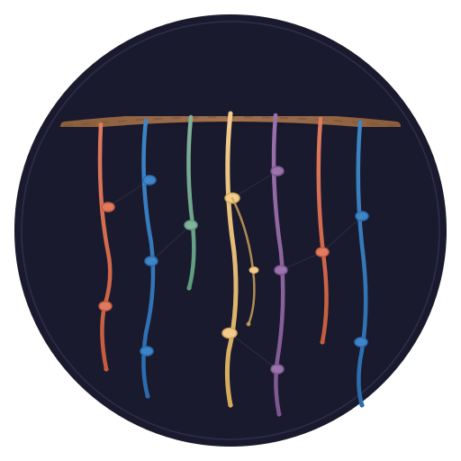
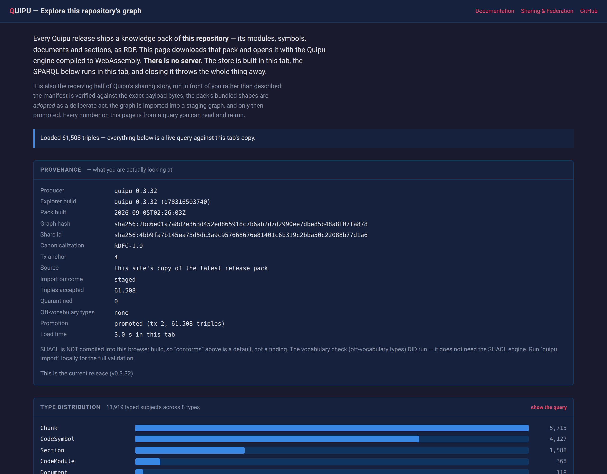
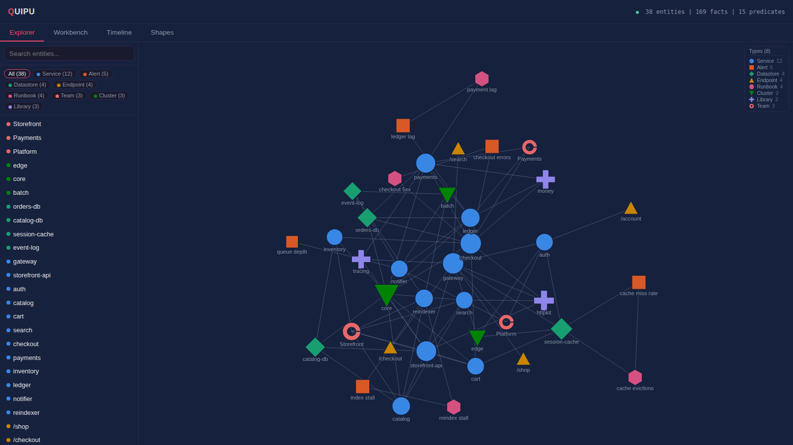

<p align="center">
  
</p>

<h1 align="center">quipu</h1>

<p align="center">
  <em>🪢 AI-native knowledge graph with strict ontology enforcement</em>
</p>

<p align="center">
    <a href="https://doi.org/10.5281/zenodo.21878428"></a>
  <a href="LICENSE"></a>
  <a href="https://www.rust-lang.org"></a>
  <a href="https://scbrown.github.io/quipu/"></a>
  <a href="https://scbrown.github.io/quipu/benchmarks/conformance.html"></a>
  <a href="https://scbrown.github.io/quipu/benchmarks/conformance.html"></a>
</p>

> *Cords are entities. Knots are facts. Colors are types. Agents are the readers.* 🧶

A [quipu](https://en.wikipedia.org/wiki/Quipu) is the Incan knotted-string recording system — a pre-Columbian knowledge graph encoded in textile. Trained readers (khipukamayuq) interpreted the structure. Quipu brings this philosophy to modern knowledge graphs: **strict structure, enforced by AI agents**.

## Sharing & Federation

**A Quipu store can hand its knowledge to another store, and compose another store's
knowledge, without either one having to trust the other by default.** Every step is
explicit, hash-verified, and labelled with where it came from — so you never absorb
someone else's knowledge by accident.

```sh
quipu share --output ./share            # a git-native bundle: facts + shapes + lineage
quipu import ./their-share              # verifies hashes, lands in QUARANTINE, not ROOT
quipu import promote <share-id>         # a named operator's explicit act
quipu status ./share && quipu merge ./share   # diverged? three-way; conflict exits 2
```

Quipu does not merge on receipt, and it does not take a peer's word for how
trustworthy that peer is: trust is **declared by the local operator, never read from
the member itself**. Federated rows carry `_provider`, `_trust` and `_freshness`, and
a partial answer is reported as partial rather than arriving as a short one.

SPARQL `SERVICE` is supported, **restricted to endpoints the operator has configured** —
variable endpoints are refused and unconfigured hosts are unreachable. That is narrower
than SPARQL 1.1's open federation by design, and Quipu makes no `SERVICE` conformance
claim.

→ **[Sharing & Federation](https://scbrown.github.io/quipu/sharing/)** — the primitive in
full, every claim citing the command or symbol that proves it.

### Explore this repository's graph, in your browser

Every release ships a knowledge pack of **this repository** — its modules, symbols,
documents and sections as RDF — and the book has a page that opens it with **Quipu
itself compiled to WebAssembly**. GitHub cannot run scripts in a README, so here is a
picture; the page is one click away.

<p align="center">
  <a href="https://scbrown.github.io/quipu/explore/"></a>
</p>

<p align="center">
  <em><strong><a href="https://scbrown.github.io/quipu/explore/">scbrown.github.io/quipu/explore</a></strong> — 61k triples imported and queried in a tab. No server.</em>
</p>

It is the **receiving half of the sharing story above, running rather than described**:
the manifest is verified against the exact payload bytes, the bundled shapes are
*adopted* as a deliberate act, and the graph is staged and then promoted — the same
`share_transport` → `share_import` → `promote` path `quipu import` takes, because it is
that code, compiled for a different target. Then you get a SPARQL box, a module and
document browser, a type distribution and a neighbourhood graph, all of it derived from
queries the page will show you. It takes any Quipu pack, not just this one.

**And it is not read-only.** Add, change or retract facts on any node — through the real
`tool_set` / `tool_retract` / `tool_episode`, the same functions the REST API exposes,
with the closed-vocabulary gate still enforcing what the sender's shapes allow. The views
update as you go, and you can take the result with you: the edited store exports as a
genuine `.qpack.tar.gz`, built by the same `share_payload` the CLI uses and declaring the
pack it came from as its parent, so `quipu import` will take it back — extract it first
and import the *directory*, since `quipu import <archive>` verifies into a throwaway
in-memory store and ignores `--db`. Or download
`export.nt` and `diff` it — it is line-oriented and canonically ordered, so a change is a
reviewable diff.

The bundle is a release asset (`quipu-<tag>-wasm.tar.gz`), so nothing here is committed
and the Pages build needs no Rust.

## See It In Action

<p align="center">
  
</p>

<p align="center">
  <em>The built-in explorer at <code>/ui</code> — the whole graph in one request, drawn on canvas.<br/>
  Run it yourself with <code>just demo</code> (<a href="examples/demo-graph/">examples/demo-graph</a>).</em>
</p>

```text
$ quipu knot infrastructure.ttl --shapes aegis-schema.ttl --db ops.db
Ingested 847 triples in transaction 1 (SHACL: 0 violations)

$ quipu read "SELECT ?svc ?host WHERE {
    ?svc a <http://example.org/WebApplication> ;
         <http://example.org/runsOn> ?host .
  }" --db ops.db

| svc       | host   |
|-----------|--------|
| gateway   | host-a |
| git       | host-b |
| metrics   | host-a |
3 results

$ quipu episode - --db ops.db <<'JSON'
{"name": "host-b-rebuild", "source": "ops/agent",
 "nodes": [{"name": "host-b", "type": "ComputeNode",
            "properties": {"status": "recovered"}}],
 "edges": [{"source": "host-b", "target": "host-a", "relation": "rebuilt_on"}]}
JSON
Ingested 6 triples in transaction 2
```

```text
$ quipu unravel --valid-at "2026-03-15T00:00:00Z" --db ops.db
# See the world as it was two weeks ago

$ quipu stats --db ops.db
Facts: 853 | Entities: 127 | Predicates: 34
```

## 🤔 Why Quipu?

|  | **Jena/Stardog** | **Graphiti/Mem0** | **Quipu** |
|--|:----------------:|:-----------------:|:---------:|
| Strict schema (SHACL)       | ✅ | ❌ | ✅ |
| Bitemporal time-travel      | ❌ | ❌ | ✅ |
| SPARQL 1.1                  | ✅ | ❌ | ✅ |
| Datalog reasoner            | ❌ | ❌ | ✅ |
| Counterfactual queries      | ❌ | ❌ | ✅ |
| Vector similarity search    | ❌ | ✅ | ✅ |
| LanceDB ANN + pushdown      | ❌ | ❌ | ✅ |
| Agent-friendly feedback     | ❌ | ❌ | ✅ |
| Episode provenance          | ❌ | ✅ | ✅ |
| Graph algorithms            | ❌ | ❌ | ✅ |
| Built-in web UI             | ❌ | ❌ | ✅ |
| Embeddable (no server)      | ❌ | ❌ | ✅ |
| SQLite-backed               | ❌ | ❌ | ✅ |
| Rust / zero dependencies    | ❌ | ❌ | ✅ |

Traditional RDF stores demand too much ceremony. AI-native stores have no structure.
Quipu's thesis: **start strict, use agents to bear the cost of strictness.**

## ✨ Features

**🏛️ Knowledge Graph Core**

- **Immutable bitemporal fact log** — every fact has transaction time and valid time. Time-travel to any point. Full audit trail. Contradiction detection.
- **RDF data model** — IRIs, blank nodes, typed literals via oxrdf. Import/export Turtle, N-Triples, JSON-LD, RDF/XML. Exports are stably ordered and can be scoped to ROOT, one named graph, an episode provenance group, or a SPARQL CONSTRUCT result; server exports use the read pool rather than blocking writers.
- **Git-native knowledge shares** — `quipu share` writes canonical `export.nt`, `shapes.ttl`, and a lineage-aware `manifest.json`; unchanged graph state produces byte-identical files and stable hashes for meaningful git diffs. Remote consumers use read-only `POST /share` to receive that exact manifest and file set without access to the server filesystem. When the store carries block-tier `InternalIdentifierPattern` rules, the producer refuses matching outbound bytes before publishing anything and never rewrites entity IRIs.
- **Shape-aware reconnect** — `quipu status` previews base/ROOT/incoming divergence, while `quipu merge` unions multi-valued RDF and emits structured decisions for `sh:maxCount` conflicts before any write.
- **SPARQL 1.1** — SELECT, ASK, CONSTRUCT, DESCRIBE. BGP, JOIN, UNION, FILTER, OPTIONAL, VALUES, ORDER BY, GROUP BY, aggregates, HAVING, property paths, `IN`/`NOT IN`, RDFS subclass inference, and named-graph scoping (`GRAPH`, `FROM`, `FROM NAMED`).
- **SHACL validation** — strict schema enforcement at write time. Structured feedback with severity, focus node, component, path, and message.
- **Graph labels & kinds** — graphs carry declared labels on five axes (freshness, trust, policy, durability, `dataKind`); datasets compose them without ever widening, and every query answer reports the composed label. Opt-in floors can refuse queries that fall below a declared bar.
- **Deep freeze** — relocate a graph's full history into a verified read-only archive pack (`quipu graph freeze`). The graph keeps its IRI and stays queryable — by name, via the `urn:quipu:dataset:frozen` dataset, or by `include_kinds: ["archive"]` on a query; `quipu graph thaw` restores it for writes. `GET /graphs` lists every registered graph with kind and lifecycle.

**🤖 AI-Native Features**

- **Episode ingestion** — structured write path for agent-extracted knowledge. Typed nodes, edges, and provenance tracking (`prov:wasGeneratedBy`). A node name may appear only once per episode: repeated entries are rejected before any triples are written, since merging them would silently append a second description to the same entity.
- **Hybrid search** — SPARQL filters candidates, vector similarity ranks them. Combine structured queries with semantic meaning in one call. Type constraints are pushed down into the vector index for O(log n) filtered search with LanceDB.
- **Dual vector backends** — default SQLite (brute-force cosine similarity), plus a LanceDB backend (ANN with predicate pushdown, Arrow columnar storage) behind `--features lancedb`. `vector.backend` in config selects it in-binary: the CLI and server install the configured backend at open, so choosing LanceDB no longer requires an embedder to call `Store::set_local_vector_backend` by hand.
- **Context pipeline** — unified knowledge context shaped for agent consumption. Text search + link expansion with configurable depth and budget.
- **Agent-friendly feedback** — validation errors include what failed, where, why, and what the valid alternatives are.

**🧠 Reasoning Engine**

- **Datalog over EAVT** — forward-chaining rules in Turtle DSL, evaluated by `datafrog` with semi-naive fixpoint. Rules are parsed and stratified; evaluation of negated body atoms is not yet implemented (the evaluator rejects `not` rules). Derived facts are first-class triples with provenance.
- **Reactive evaluation** — `TransactObserver` re-runs affected rules on every write. Delta-aware: only changed predicates trigger re-evaluation. Behind the non-default `reactive-reasoner` feature; `reason --reactive` errors without it.
- **Counterfactual queries** — `Store::speculate()` forks a hypothetical view via SQLite SAVEPOINT. Answer "what if we remove X?" without mutation.
- **Impact analysis** — BFS walk over entity edges with configurable depth and predicate filters. CLI (`quipu impact`), REST (`POST /impact`), and MCP tool.

**⚙️ Infrastructure**

- **Git-native composition** — `quipu import <share-dir>` verifies the v1 manifest and payload hashes, resolves exact entity matches, surfaces fuzzy candidates for review, validates against local SHACL shapes, and stages each source in a named graph. Off-vocabulary or non-conforming shares remain quarantined; only `quipu import promote <share-id>` explicitly admits an eligible graph to ROOT.

- **Graph projection** — materialize subgraphs into petgraph for centrality, connected components, shortest path algorithms.
- **Federation** — a `GraphProvider` trait for multi-source queries, with a `RemoteProvider` (behind the `remote` feature) built from `federation.remotes` config. The server health-checks every configured remote at startup, and `POST /query` with `"federated": true` fans out through the federated provider, reporting which members answered. Remotes carry declared trust labels at the federation edge, so a federated answer composes the labels of every member that contributed rather than silently inheriting the caller's. Federation config is read-side only: adding a remote never turns it into an outbound replication target or bypasses the share scrub/import boundary.
- **Graph explorer** — the web UI draws the whole node-link view from a single `POST /graph` payload (nodes plus index-addressed edges), laid out with a Barnes-Hut force simulation on canvas. No CDN, so it renders on an air-gapped deploy.
- **Four interfaces** — Rust crate (embed), CLI (`quipu`), REST API (`quipu-server`), and built-in web UI with embeddable web components. Plus 45 MCP tools for agent integration (47 with the `owl` feature).
- **"SQLite energy"** — single process, no server required, inspect with `sqlite3`, back up with `cp`.
- **Automated releases** — release-plz bumps versions from conventional commits, generates changelogs via git-cliff, and creates GitHub releases. Version discovery is `git_only = true`: the baseline comes from this repository's tags, never the unrelated `quipu` crate on crates.io. CI runs fmt, clippy, tests, and markdown lint on every push. The current published release is v0.3.27; `/version` also reports the deployed git SHA, which matters because a deployment can legitimately sit AHEAD of the newest tag — the SHA, not the version string, identifies what is actually running.

## 🚀 Quick Start

### 📦 As a Rust Library

```toml
[dependencies]
quipu = { git = "https://github.com/scbrown/quipu" }
```

```rust
use quipu::store::Store;
use quipu::rdf::ingest_rdf;
use quipu::sparql;
use oxrdfio::RdfFormat;

let mut store = Store::open_in_memory()?;

let turtle = r#"
@prefix ex: <http://example.org/> .
ex:alice a ex:Person ; ex:name "Alice" ; ex:knows ex:bob .
ex:bob a ex:Person ; ex:name "Bob" .
"#;
ingest_rdf(&mut store, turtle.as_bytes(), RdfFormat::Turtle,
           None, "2026-04-04", None, None)?;

let result = sparql::query(&store,
    "SELECT ?name WHERE { ?s a <http://example.org/Person> . ?s <http://example.org/name> ?name }")?;
```

### 💻 From the Command Line

```bash
git clone https://github.com/scbrown/quipu && cd quipu
cargo build --release

# Load, query, explore
quipu knot data.ttl --db my.db
quipu read "SELECT ?s ?p ?o WHERE { ?s ?p ?o } LIMIT 10" --db my.db
quipu repl --db my.db

# Governance: check an agent's enforcement trace against the policy set
quipu audit trace.jsonl --db my.db          # T ⊨ Σ — exits 1 on a violation
quipu audit inventory --db my.db            # which tool classes are ungoverned
quipu audit namespace --db my.db            # which minted predicates no shape mentions
quipu audit replay trace.jsonl --db my.db   # advise → enforce readiness, per rule
```

### 🌐 REST API & Web UI

```bash
# quipu-server needs `onnx` (the embedding runtime) AND `server` (axum/tokio —
# the HTTP stack is feature-gated so the library does not carry a web server).
# Neither is on by default, and an unmet required-feature SKIPS the binary
# silently rather than erroring, so build the `full` bundle releases ship:
cargo build --release --features full

quipu-server --db my.db --bind 0.0.0.0:3030

# Open the interactive graph explorer in your browser
open http://localhost:3030

# Or use the REST API directly
curl localhost:3030/query -X POST \
  -H "Content-Type: application/json" \
  -d '{"query": "SELECT ?s ?p ?o WHERE { ?s ?p ?o } LIMIT 5"}'
```

The built-in web UI provides:

- **Graph Explorer** — force-directed visualization with type-based coloring, entity search, and detail panel
- **SPARQL Workbench** — syntax-highlighted editor with time-travel parameters and tabular/JSON results
- **Episode Timeline** — chronological view of ingested episodes with extracted entities
- **Schema Inspector** — type distribution, SHACL shape browser, and validation runner

Embeddable web components (`<quipu-graph>`, `<quipu-sparql>`, `<quipu-entity>`, `<quipu-timeline>`, `<quipu-schema>`) let you drop Quipu panels into any page:

```html
<script src="http://localhost:3030/quipu-components.js"></script>
<quipu-graph endpoint="http://localhost:3030"></quipu-graph>
```

Semantic Web APIs for interoperability:

- **Spotlight** — entity recognition/disambiguation (`POST /spotlight`)
- **Triple Pattern Fragments** — LDF-compatible pagination (`GET /fragments`)
- **OpenRefine Reconciliation** — data cleaning integration (`POST /reconcile`)
- **Content Negotiation** — `GET /entity/{iri}` returns JSON-LD, Turtle, or HTML based on Accept header

### 🧠 Reasoner

```bash
# Impact analysis — what depends on this entity?
quipu impact http://example.org/gateway --db ops.db

# Counterfactual — what breaks if we remove it?
quipu impact http://example.org/gateway --remove --db ops.db

# Run Datalog rules over the fact log
quipu reason --rules rules.ttl --db ops.db
```

The reasoner adds forward-chaining inference over the EAVT fact log:

- **Datalog rule engine** — rules written in Turtle DSL, evaluated with semi-naive `datafrog`. Negation is parsed and stratified, but evaluation of negated body atoms is not yet implemented (the evaluator rejects `not` rules). Derived facts written back via `Store::transact()` with full provenance.
- **Reactive evaluation** — `TransactObserver` keeps derived facts fresh as base facts change. Delta-aware: only affected rules re-run. Optional `reactive-reasoner` feature.
- **Counterfactual queries** — `Store::speculate()` forks a view (SQLite SAVEPOINT) to answer "what if?" without mutation.
- **Impact analysis** — BFS walk over entity edges with configurable hop depth and predicate filters. Available as CLI, REST endpoint (`POST /impact`), and MCP tool.

## 🏗️ Architecture

```text
                    ┌──────────────────────────────┐
                    │    Agent / CLI / Bobbin       │
                    └──────────┬───────────────────┘
                               │
              ┌────────────────┼────────────────┐
              │                │                │
        ┌─────┴─────┐   ┌─────┴─────┐   ┌──────┴──────┐
        │ MCP Tools  │   │ REST API  │   │  Rust API   │
        │ (45 tools) │   │ + Web UI  │   │  (crate)    │
        └─────┬─────┘   └─────┬─────┘   └──────┬──────┘
              └────────────────┼────────────────┘
                               │
     ┌─────────────────────────┼─────────────────────────┐
     │                         │                         │
┌────┴────┐  ┌────┴─────┐  ┌──┴───────┐  ┌──────────────┴──────────────┐
│ SPARQL  │  │  SHACL   │  │ Reasoner │  │   KnowledgeVectorStore      │
│ Engine  │  │ Validator│  │ (Datalog)│  │         (trait)             │
└────┬────┘  └────┬─────┘  └──┬───────┘  └──────┬─────────┬───────────┘
     │             │           │                 │         │
     └─────┬───────┴───────────┘          ┌──────┴───┐ ┌───┴──────┐
           │                              │  SQLite  │ │ LanceDB  │
           │                              │ (default)│ │(optional)│
     ┌─────┴──────────────┐               └──────────┘ └──────────┘
     │   EAVT Fact Log    │
     │   (SQLite)         │
     │                    │
     │  facts + terms +   │
     │  shapes + rules    │
     └────────────────────┘
```

## 🧵 Bobbin Integration

Quipu is designed as a [Bobbin](https://github.com/scbrown/bobbin) subsystem.
Bobbin holds the thread (code context); Quipu ties knots of structured meaning into it.

When running as a Bobbin subsystem, agents get 45 MCP tools (47 with the
`owl` feature). The two most
commonly used for knowledge-aware context:

**`quipu_context`** — unified knowledge discovery. Bobbin merges the result
with its own code search to give agents both code and knowledge in one response.

```json
{
  "tool": "quipu_context",
  "input": { "query": "gateway reverse proxy", "max_entities": 10 }
}
// Returns ranked entities with facts, types, and relevance scores
```

**`quipu_episode`** — save agent-extracted structured knowledge with full
provenance tracking.

```json
{
  "tool": "quipu_episode",
  "input": {
    "name": "deploy-v3",
    "source": "aegis/ellie",
    "nodes": [{"name": "gateway", "type": "WebApplication",
               "properties": {"version": "3.0"}}],
    "edges": [{"source": "gateway", "target": "host-a", "relation": "runs_on"}]
  }
}
```

Embeddings are shared: Bobbin's ONNX pipeline (`all-MiniLM-L6-v2`) provides
384-dimensional vectors to both its code search and Quipu's knowledge search,
enabling hybrid queries that span both domains.

### Agent access

When Quipu MCP tools are configured, agents should use them first so structured
inputs, validation feedback, and provenance stay in the tool contract. Use the
native `quipu` CLI second for local databases and offline work. Raw HTTP is the
portability fallback; endpoint shapes and authentication are in the
[REST API reference](docs/book/src/reference/rest-api.md).

Named graphs are first-class query scopes, and named datasets are reusable sets
of graphs. ROOT remains the default until a caller explicitly selects a graph or
dataset with SPARQL `FROM` / `FROM NAMED`, the query `graph` field, or
the query tool's graph field. This permits an application to ground a request in
one declared plane without silently widening into every graph. See
[Named Graphs](docs/book/src/concepts/named-graphs.md) for the registration,
write, and trust-label rules.

## 📖 Documentation

**📚 [scbrown.github.io/quipu](https://scbrown.github.io/quipu/)** — the full book,
published from `main` on every docs change.

Or build it locally:

```bash
cargo install mdbook mdbook-mermaid
mdbook serve docs/book
```

The table of contents lives in [docs/book/src/SUMMARY.md](docs/book/src/SUMMARY.md).
Design notes that are not part of the book (named graphs, federation, the
reasoner, the governance backlog) are in [docs/design/](docs/design/). The
governance plane's own map — what SARC asks for, what is built, and what each
phase did *not* close — lives in hank's book under
[SARC Conformance](https://scbrown.github.io/hank/design/sarc-conformance.html),
because the two repos implement it jointly.

## 📋 Feature Matrix

Legend: ✅ available in the shipped `quipu` CLI / `quipu-server` · 🔩 library
primitive only, not reachable from the shipped binaries · 🔜 planned.

| Feature | Status | Notes |
|---------|:------:|-------|
| **Core** | | |
| EAVT bitemporal fact log | ✅ | Immutable, time-travel queries |
| RDF data model (oxrdf) | ✅ | Turtle, N-Triples, JSON-LD, RDF/XML |
| SQLite storage | ✅ | Single-file, embeddable |
| Retraction with valid-time closure | ✅ | |
| Graph labels (5-axis lattice + floors) | ✅ | freshness / trust / policy / durability / `dataKind`; composition never widens |
| Graph kinds + `include_kinds` widening | ✅ | `GET /graphs` listing; fetch-time opt-in for composing cold graphs |
| Deep freeze / thaw | ✅ | `quipu graph freeze\|thaw\|list` — full-history read-only archive packs, auto-attached on open |
| **SPARQL 1.1** | | |
| SELECT / ASK / CONSTRUCT / DESCRIBE | ✅ | |
| BGP, JOIN, UNION, FILTER, OPTIONAL | ✅ | |
| ORDER BY, GROUP BY, HAVING | ✅ | |
| Aggregates (COUNT, SUM, AVG, MIN, MAX) | ✅ | |
| BIND / Extend | ✅ | |
| Property paths | ✅ | ROOT default graph only; fails loud inside a named `GRAPH` |
| `VALUES` inline relations | ✅ | Multi-column and `UNDEF` |
| `FILTER ... IN` / `NOT IN` | ✅ | |
| Temporal queries (valid_at, as_of_tx) | ✅ | |
| RDFS subclass inference | ✅ | |
| SPARQL UPDATE | 🔜 | Planned |
| Named graphs (`GRAPH`/`FROM`/`FROM NAMED`) | ✅ | Query side; writes go via overlays or `/episode`. See [named-graphs.md](docs/design/named-graphs.md) |
| Full SPARQL federation (SERVICE) | 🔜 | Planned |
| **Schema & Validation** | | |
| SHACL write-time validation | ✅ | Optional `shacl` feature |
| Persistent shape storage | ✅ | |
| Aegis ontology shapes | ✅ | Infrastructure entities |
| Code entity shapes | ✅ | CodeModule, CodeSymbol, etc. |
| OWL reasoning | ✅ | Optional `owl` feature |
| **Governance ([SARC](docs/book/src/reference/cli.md#quipu-audit-tracejsonl) conformance)** | | |
| `aegis:Policy` write-time gate | ✅ | Class-aware effects, evaluated before commit |
| Constraint metadata (class, verification point, θ, τ_rev) | ✅ | `shapes/governance.ttl` |
| Tripwire path-boundary policies (`aegis:appliesTo`) | ✅ | `shapes/policies/tripwire.ttl`; deny hard @ PAG, throttle soft @ PAA |
| Class ↔ placement conformance | ✅ | Refused at write; a soft constraint cannot be placed at the gate |
| Signed verdicts (ed25519) | ✅ | Evidence-hash-bound, verified against a human-authored root of trust |
| Escalation router with a bounded window | ✅ | Default-deny past `τ_rev`; records the request, does not deliver it |
| Authority intersection over named graphs | ✅ | Off by default; a delegate can only narrow |
| `T ⊨ Σ` audit checker | ✅ | `quipu audit`; four passes, deterministic, never an LLM call |
| Dispatch-graph inventory (I7) | ✅ | `quipu audit inventory`; ungoverned classes are data, not prose |
| Namespace-drift report | ✅ | `quipu audit namespace`; report-only, never refuses a write |
| Replay / promotion readiness | ✅ | `quipu audit replay`; counts blocks, cannot label false positives |
| Attribution tree, constraint inheritance | ✅ | `quipu audit tree` / `inheritance` — reconstructed from principal chains |
| Trust predicate over imported state | 🔜 | The boundary is declared and reported; nothing evaluates the content |
| Escalation queue metrics (`W_q < τ_rev`) | 🔜 | Needs a server behind the queue; unmeasured today |
| **AI-Native** | | |
| Episode ingestion (Graphiti-compatible) | ✅ | Typed nodes, edges, provenance |
| SQLite vector search (cosine) | ✅ | Default backend |
| LanceDB ANN + predicate pushdown | 🔩 | `lancedb` feature; embedder-only — not selectable via config in the CLI/server |
| LanceDB full-text search (BM25) | 🔜 | Library path exists but is unreachable from the shipped CLI/server; `/context` uses the SPARQL `CONTAINS` fallback |
| Hybrid SPARQL + vector search | ✅ | |
| Auto-embed on write | ✅ | Knot/episode hooks |
| ONNX embedding pipeline | ✅ | Shared with Bobbin |
| Context pipeline | ✅ | Text search + link expansion |
| **Reasoner** | | |
| Impact analysis (BFS) | ✅ | CLI, REST, MCP tool |
| Datalog rule engine (datafrog) | ✅ | Turtle DSL; stratification present, negated-atom evaluation not yet implemented (evaluator rejects `not` rules) |
| Reactive evaluation | ✅ | TransactObserver, delta-aware. Optional `reactive-reasoner` feature; `reason --reactive` errors without it |
| Counterfactual queries | ✅ | `speculate()` via SQLite SAVEPOINT |
| Incremental truth maintenance | 🔜 | Planned (Phase 5) |
| **Interfaces** | | |
| Rust crate (embed) | ✅ | |
| CLI (`quipu`) | ✅ | knot, read, repl, episode, impact, reason, audit |
| REST API (`quipu-server`) | ✅ | Axum-based |
| Web UI | ✅ | Explorer, workbench, timeline, schema |
| Graph explorer | ✅ | Canvas + Barnes-Hut layout, one `POST /graph` payload, no CDN |
| Web components | ✅ | Embeddable `<quipu-*>` elements |
| Semantic Web APIs | ✅ | Spotlight, TPF, OpenRefine reconciliation |
| MCP tools (45; 47 with `owl`) | ✅ | Agent integration |
| Python bindings | ✅ | `quipu-client` under `python/` — REST client, stdlib-only |
| **Infrastructure** | | |
| Graph projection (petgraph) | ✅ | Centrality, shortest path, etc. |
| GraphProvider federation trait | ✅ | `RemoteProvider`, startup health checks, `federated: true` on `/query` |
| Bobbin integration | ✅ | Namespace, IRI patterns, search |
| Automated releases (release-plz) | ✅ | |
| Clustering / replication | 🔜 | Planned |

## 🛠️ Development

```bash
just build               # Build
just test                # Run all tests
just lint                # Clippy with -D warnings
just fmt                 # Format
just check               # Full quality gate (all pre-commit hooks)
just docs check          # Markdown lint + mdbook build
```

Pre-commit hooks enforce formatting, clippy, tests, and file size limits.
CI runs the same checks on every push via GitHub Actions.

## 🤝 Contributing

See [CONTRIBUTING.md](CONTRIBUTING.md) for development setup and guidelines.

## 📄 License

[MIT](LICENSE)
