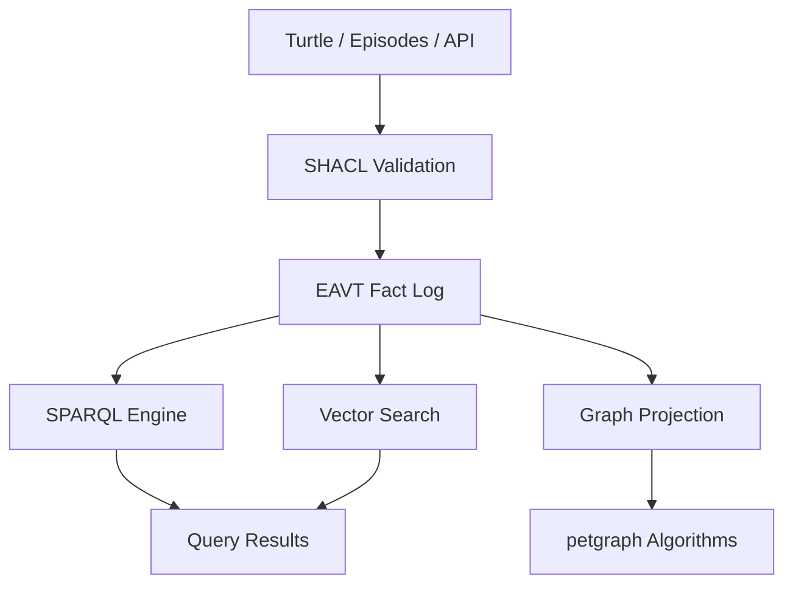

# Quipu

**Structured knowledge encoded in knotted strings.**

A [quipu](https://en.wikipedia.org/wiki/Quipu) is the Incan knotted-string
recording system. Cords are entities, knots are facts, colors are types, and
trained readers interpret the structure. Quipu brings this philosophy to modern
knowledge graphs: strict structure, enforced by AI agents.

## What is Quipu?

An embeddable Rust library and server for building knowledge graphs with:

- **Immutable bitemporal fact log** — time-travel, contradiction detection,
  full audit trail
- **RDF data model** — IRIs, blank nodes, typed literals via oxrdf
- **SPARQL 1.1 query engine** — SELECT, CONSTRUCT, ASK, DESCRIBE with
  property paths, aggregates, RDFS inference
- **SHACL validation** — strict schema enforcement at write time with
  structured agent-friendly feedback
- **Hybrid search** — SPARQL + vector similarity in a single query
- **Episode ingestion** — structured write path for agent-extracted knowledge
- **Graph projection** — materialize subgraphs into petgraph for centrality,
  components, shortest-path algorithms
- **"SQLite energy"** — single process, no server required

## Three Ways to Use It

| Interface | Use case |
|-----------|----------|
| **Rust crate** | Embed in your application |
| **CLI** (`quipu`) | Interactive queries and scripting |
| **REST API** (`quipu-server`) | Service deployment |

## Who Is This For?

This book is organized around four personas — pick the one that fits you:

| Persona | You want to... | Start here |
|---------|----------------|------------|
| **Homelab Operator** | Model hosts, services, and dependencies | [Tutorial](tutorials/homelab-operator.md) |
| **AI Agent Builder** | Let agents share structured knowledge | [Tutorial](tutorials/agent-builder.md) |
| **Code Archaeologist** | Understand how a codebase evolved | [Tutorial](tutorials/code-archaeologist.md) |
| **Knowledge Gardener** | Curate and validate an ontology | [Tutorial](tutorials/knowledge-gardener.md) |

New to SPARQL? Start with [SPARQL from Zero](tutorials/sparql.md) — it builds up
from a single triple to aggregates and temporal queries using concrete examples.

## Quick Taste

```bash
# Load some facts
quipu knot data.ttl --db my.db

# Query with SPARQL
quipu read "SELECT ?name WHERE { ?s <http://example.org/name> ?name }" --db my.db

# Start the server
quipu-server --db my.db --bind 0.0.0.0:3030

# Query over HTTP
curl -s localhost:3030/query -X POST \
  -H "Content-Type: application/json" \
  -d '{"query": "SELECT ?s ?p ?o WHERE { ?s ?p ?o } LIMIT 5"}'
```

## Architecture at a Glance



Facts enter through validation, land in the immutable log, and are queryable
through SPARQL, vector similarity, or graph algorithms. Every fact has a
transaction timestamp and an optional valid-time window — you can always
time-travel to see the state at any point.
