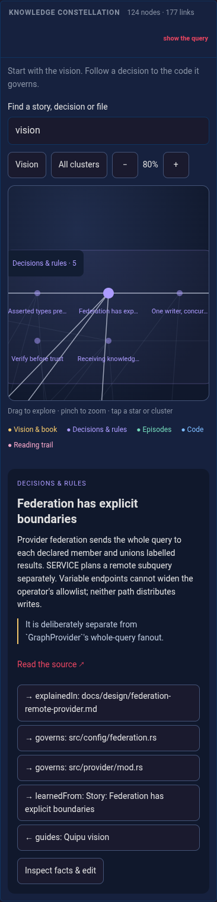

# Explore the contributor constellation

Open [Explore](../explore/.) to follow the ideas behind Quipu into the code.
The repository pack includes the vision, source-backed episodes, design decisions,
a trust directive, and the book's chapter order alongside indexed code and docs.
The vision remains an aspiration; each decision links to its own evidence and
implementation. These narratives are extracted from repository documents, not
imported from an operational knowledge graph.

## A phone walkthrough

At a 390px-wide viewport:

1. In **Knowledge constellation**, search for **vision**, then select **Quipu vision**.
2. In its card, tap **guides: Federation has explicit boundaries**.
3. Read the decision and its source excerpt. Tap **governs: src/provider/mod.rs**
   to reach the actual indexed code module.
4. **Read the source** opens the repository file; **Inspect facts & edit** opens
   its local facts. SPARQL, export and the propose-as-PR flow remain available.



The cluster outlines separate vision, decisions, episodes, code and reading.
Positions stay fixed while you explore. Drag or use arrow keys to pan; pinch,
use the mouse wheel or the zoom buttons to zoom. **All clusters** fits the
reading map; tap a cluster to enter it. At that overview scale, cluster controls
replace individual node controls. Visible node targets and controls are at least
44 CSS pixels, independent of zoom. The node card and search results provide
text navigation without hovering or precise graph taps.

## Ask the same question with SPARQL

The canned **How does the vision guide code?** query follows two explicit edges
and checks the indexed module's path. It does not infer that a similarly named
file implements a decision.

```sparql
PREFIX q: <https://quipu.dev/knowledge/>
SELECT ?decision ?module WHERE {
  q:vision q:guides ?decision .
  ?decision q:governs ?module .
  ?module a ?type .
}
```

## Keep the released knowledge current

The release producer runs `scripts/build-contributor-knowledge.mjs` after Bobbin
indexes the repository. Its curated registry is
`docs/knowledge/contributor-stories.json`. Each story names a source passage and
code witnesses; generation refuses a missing passage, missing file, or private
identifier in the curated text. The book order comes from `SUMMARY.md`.

The producer includes this projection in its ordinary CONSTRUCT share scope,
then adopts shapes, imports and promotes into a fresh receiver. The contributor
proof requires all six knowledge classes, four source-backed episodes, and
vision → decision → typed code paths. A code-only pack cannot pass that proof.
The release workflow ships that same output as its repository qpack asset.

Use `just contributor generate` to inspect the deterministic projection.
`QUIPU_BIN=/path/to/quipu just contributor pack /tmp/repository-share` runs the
full producer and receiver proof. The output directory must not already exist.
The page consumes the released artifact when the documentation build stages it;
a source change alone does not change the pack already on the site.

The browser's delta producer uses the same 128 MiB payload budget as its full
export, so adding contributor knowledge does not disable proposing an edit.
The default remote delta budget remains 8 MiB. During release publication, docs
allow missing, not-yet-staged assets for 30 minutes. Once staged, every asset
must be published byte-for-byte; beyond the grace a missing asset fails.
