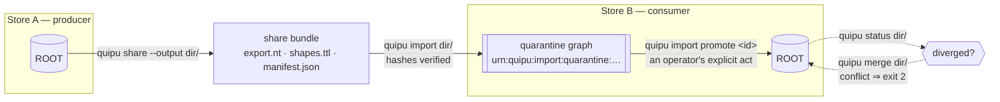

# Sharing & Federation

> **The primitive:** a Quipu store can hand its knowledge to another store, and
> compose another store's knowledge, **without either one having to trust the
> other by default**. Every step is explicit, hash-verified, and labelled with
> where it came from — so you never absorb someone else's knowledge by accident.

That is the whole idea. The rest of this page is how it works, and what proves
it.

## One run, end to end

This transcript is not illustrative output. It is
[`examples/sharing-demo/expected.txt`](https://github.com/scbrown/quipu/blob/main/examples/sharing-demo/expected.txt),
included here verbatim. `just sharing-demo` creates two fresh stores and checks
that a new run still matches it; the required CI `Build` job runs the same
check.

```text
{{#include ../../../../examples/sharing-demo/expected.txt}}
```

The receiver first quarantines the intact bundle because the type is not in
its local vocabulary. It then adopts the bundled shape deliberately, re-imports,
and promotes with a named actor. After A and B make independent additions,
`status` proves both histories moved and `merge` records two provenance parents.
The demo intentionally stops at the current boundary: provider federation
unions labelled query results but does not merge store histories. The broader
evaluation and claims belong to the
[arXiv submission source for the shape-aware merge paper](https://github.com/scbrown/quipu/tree/main/docs/paper-merge),
not to this ten-line walkthrough.

Every claim below names the command, symbol, or verbatim message that backs it,
so you can check it rather than believe it. Citations are file plus symbol, not
line numbers, because line numbers rot and a page that cites them stops being
true without anyone editing it. Quoted messages are exact — grep for them.

Two things most graph databases do, Quipu deliberately does not. It does not
merge on receipt, and it does not take a peer's word for how trustworthy that
peer is.



## What a share is

A **share** is a directory you can commit to git, attach to an email, or publish
as a release asset. `quipu share --output <dir>` writes it deterministically
(`src/cli_pack.rs`, `cmd_share`), and it holds exactly three files — the same
three `quipu import` reads back (`cmd_import`):

| File | What it carries |
|---|---|
| `export.nt` | the facts, as N-Triples |
| `shapes.ttl` | the SHACL shapes those facts were validated against |
| `manifest.json` | hashes, producer name and version, and the lineage link |

The manifest's `parent_share` field (`src/share.rs`, `ShareOptions`) is what
makes a share a *link in a chain* rather than a loose dump: it names the share
this one descends from, which is what later lets `quipu merge` find a common
base.

Shares carry their shapes on purpose. A receiving store is never asked to guess
what the sender meant by a predicate — it gets the constraints alongside the
facts.

## Receiving: verify, quarantine, promote

Import is **two verbs**, and the split is the point.

```sh
quipu import ./their-share --source https://example.org/share --actor alice
quipu import promote <share-id> --actor alice
```

`quipu import` verifies before storing anything. It recomputes the payload hash
and refuses a mismatch (`src/share_import.rs`, `verify_share`):

```text
share graph hash mismatch: manifest=… actual=…
```

What survives verification lands in a **quarantine graph** named
`urn:quipu:import:quarantine:<hash>` (`staging_graph`) — present in the store,
queryable, and *not* part of ROOT. The result reports an `ImportCounts` split of
admitted versus quarantined triples.

`quipu import promote` is the separate, actor-attributed step that moves a staged
share into ROOT (`cmd_import`, the `promote` arm). Nothing reaches your ROOT
because a file arrived; it reaches ROOT because a named person ran the second
command.

## Identity across stores

Two stores will call the same thing by different names. Quipu does not paper over
that with string matching: `quipu knot` writes real `owl:sameAs` edges, so the
claim "these two IRIs are one entity" is itself a fact in the graph — visible,
queryable, and retractable like any other fact.

## What travels: facts, graphs, whole repositories

A share is the portable graph artifact. Its scope may be a slice of facts, a
whole graph, or a repository graph; a release `.qpack.tar.gz` is a deterministic
archive of the same text bundle, not a SQLite database. The bundle contains a
canonical RDF payload, SHACL shapes, and JSON plus PROV-O/DCAT/SPDX RDF
manifests (`src/share.rs`: `share_payload`, `manifest_turtle`).

Import accepts a directory, archive, or HTTP(S) release artifact. URL and archive
inputs are bounded, verified, and loaded into a fresh in-memory store without a
user-visible download (`src/share_transport.rs`: `read_reference`,
`import_in_memory`). Verification is unchanged because bytes arrived over the
network: graph, shapes, and envelope hashes must agree before the store is
opened.

For a modified copy, `--since` writes a parent-bound delta using the deliberately
restricted, interoperable part of SPARQL 1.1 Update:

```sh
quipu share --out child --since <parent-share>
quipu import delta <parent-share> child
```

The delta contains only ground `DELETE DATA` and `INSERT DATA`. Its manifest
names and hashes the immediate parent and the materialized result; the importer
rejects a wrong parent, a changed update, any other Update operation, or a result
digest mismatch (`src/share_delta.rs`: `write_delta`, `materialize`). These are
local artifact writes and reads: they do not send a delta to a remote store or
grant ROOT admission.

The older SQLite pack commands remain an internal/archive compatibility surface:

```sh
quipu pack <graph-iri> --out <file>     # export a graph as an attachable pack
quipu pack --verify <file>              # check one before trusting it
quipu unpack <file> [--into <graph-iri>]
```

(`src/cli_pack.rs`: `cmd_pack`, `cmd_unpack`.) `--verify` exists so that "is this
pack intact?" is answerable *before* you load it rather than after. SQLite packs
are no longer the published repository interchange artifact.

For archives, `quipu graph freeze|thaw|list` is the **deep freeze** surface
(`src/cli_graph.rs`), producing read-only full-history graphs. See
[Graph Kinds & Deep Freeze](../concepts/graph-kinds.md) and
[Knowledge Packs](../concepts/knowledge-packs.md).

## Querying across stores

A `FederatedProvider` composes members behind one query (`src/provider/mod.rs`),
and two properties are what make its answers honest.

**Trust is declared locally.** A member's `DeclaredLabel` carries only `trust`
and `freshness` — in the source's words, "the axes an operator can honestly
declare about a peer" — and it is **declared by the local operator, never read
from the member itself** (`src/provider/label.rs`). A remote that declares
nothing does not quietly pass a configured floor: an undeclared value **fails** a
configured trust or freshness floor, which the source describes as "fail-safe at
enforcement, honest at reporting". And because durability, policy and kind cannot
be honestly declared *about* a remote, a remote member degrades a dataset's
coverage on those axes to `partial` — "the conservative reading, not an
omission".

**A merge is never silent.** `FederatedQuery` returns one `ProviderOutcome` per
member (`src/provider/mod.rs`), so a partial answer is reported as a partial
answer instead of arriving as a short one. And when a share has diverged,
`quipu merge` performs a genuine three-way reconnect against the common base
located through `parent_share` (`src/share_merge.rs`, `locate_base` — which
refuses outright with "incoming share has no parent_share; three-way merge has no
base"). Conflicts are detected against the SHACL cardinalities (`max_counts`); on
conflict Quipu **keeps the base value**, emits a `DecisionRecord`, and the CLI
exits **2** (`src/cli_pack.rs`, `cmd_merge`). It would rather stop and tell you
than pick a winner.

## Federation and SPARQL `SERVICE`

Quipu supports SPARQL `SERVICE`, **restricted to endpoints the operator has
configured**. Queries are parsed by `spargebra` (`src/sparql/mod.rs`) and the
`SERVICE` pattern is evaluated in `src/sparql/pattern.rs` under the `remote`
feature — which `server` implies and the shipped `full` build includes
(`Cargo.toml`).

It is narrower than SPARQL 1.1's open federation, by design:

- **Variable endpoints are refused** — *"variable SERVICE endpoints are refused;
  use a configured endpoint IRI"*. A query cannot compute its target at runtime.
- **Unconfigured hosts are unreachable** — with no configured remotes an endpoint
  fails with *"SERVICE endpoint '…' is unavailable: no configured remotes"*, or
  returns the seed row under `SILENT`.
- **Every returned row is labelled** — `_provider` always, plus `_trust` and
  `_freshness` where you declared them. A federated answer cannot arrive
  anonymous.

The pinned W3C federated-query ledger scores all seven approved `SERVICE`
cases. Quipu implements `SERVICE` as a query-planned remote subquery path using
the same operator-configured declarations and labels as `RemoteProvider`; it is
not the `GraphProvider` whole-query fanout path, and it is not open federation.
The variable-endpoint case is a deliberate policy
deviation because query data cannot widen the operator's remote allowlist.
See [SPARQL 1.1 conformance](../benchmarks/conformance.md) for the measured
score and named verdicts.

## The whole stack speaks it

A primitive is only first-class if the tools around it use it, rather than reaching
past it. The same share format and the same verify → quarantine → promote discipline
appear at every layer:

| Layer | What speaks the format |
|---|---|
| **CLI** | `quipu share` / `import` / `import promote` / `status` / `merge` |
| **MCP** | `quipu_export`, `quipu_import`, `quipu_import_promote` |
| **Bobbin** | `bobbin:src/knowledge/share_contract.rs` plus its `quipu-share-v1` fixtures |

The MCP layer is worth a second look, because the discipline is in the **tool
contract**, not merely in the documentation. `quipu_import`'s own description reads
*"Stage a v1 share bundle into a per-source named graph. **Never promotes.**"*, and
promotion is a separate tool. An agent working through MCP therefore gets the same
two-step admission an operator gets at the CLI — without having to know to ask for
it, and without a way to skip it by accident.

Bobbin carries the canonical fixture set — `export.nt`, `manifest.json`, `shapes.ttl`
and the import request/response pair — so "does this bundle conform?" is a test in
another repository rather than a claim made in this one.

## Built vs designed

Everything described above is built and reachable from the CLI today. The gaps
are stated here rather than left to be inferred from careful wording.

| Capability | Status |
|---|---|
| `share` / URL `import` / `import promote` / `status` / `merge` | ✅ Built (`src/cli_pack.rs`, `src/share_transport.rs`) |
| Parent-bound SPARQL Update delta write/materialize | ✅ Built (`src/share_delta.rs`) |
| SQLite `pack` / `unpack` / `pack --verify`, deep freeze | ✅ Internal compatibility/archive surface (`src/cli_pack.rs`, `src/cli_graph.rs`) |
| `knot` — `owl:sameAs` across stores | ✅ Built |
| Provider model, declared trust/freshness, per-member outcomes | ✅ Built (`src/provider/`) |
| SPARQL `SERVICE` to operator-configured endpoints | ✅ Built (feature `remote`) |
| MCP share tools — `quipu_export` / `quipu_import` / `quipu_import_promote` | ✅ Built and provisioned |
| Bobbin share **contract** + `quipu-share-v1` fixtures | ✅ Built (`bobbin:src/knowledge/share_contract.rs`) |
| Bobbin **runtime adapter** — producing and consuming bundles live | 🔶 **Designed, not built.** The contract and fixtures exist; the adapter does not yet. |
| External share **attestation** — proving *who* produced a share | 🔶 **Designed, not built.** Hash verification proves a share is intact; it does not yet prove authorship. |
| Re-runnable two-store transcript | ✅ Built (`examples/sharing-demo/run.sh`), checked in CI, and embedded above from `expected.txt` |
