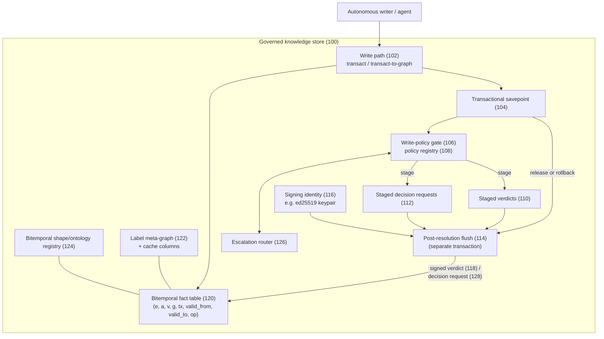
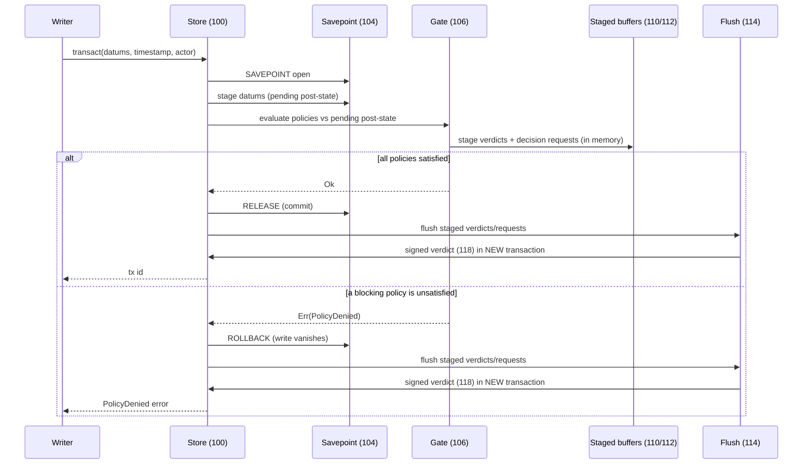
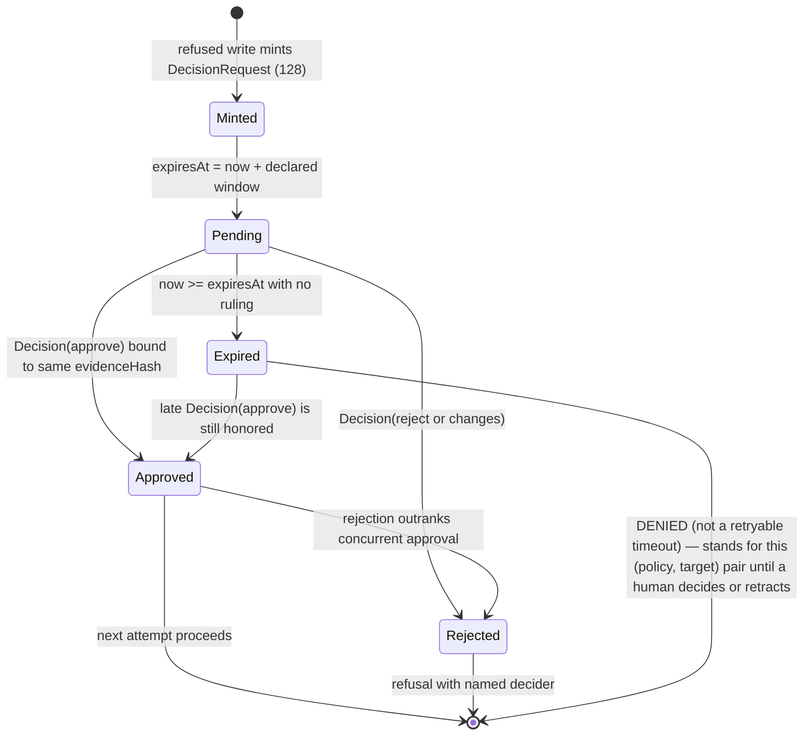
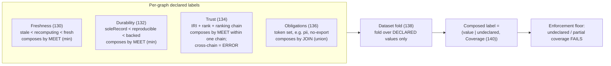
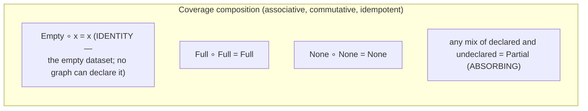
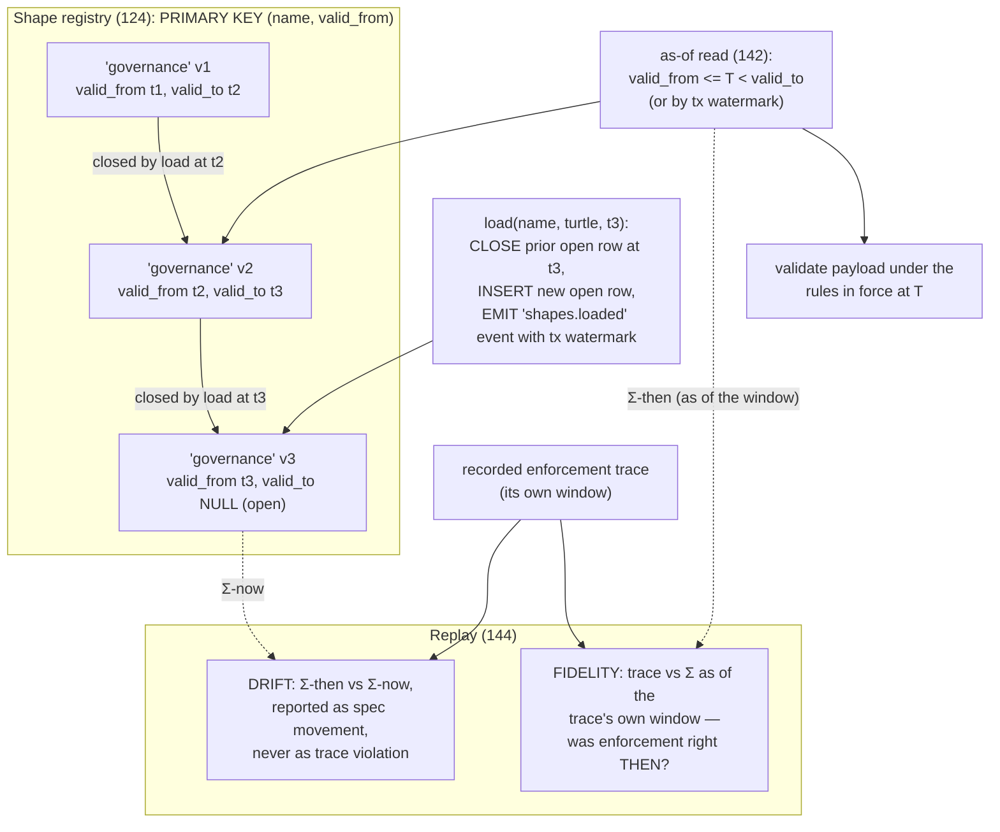
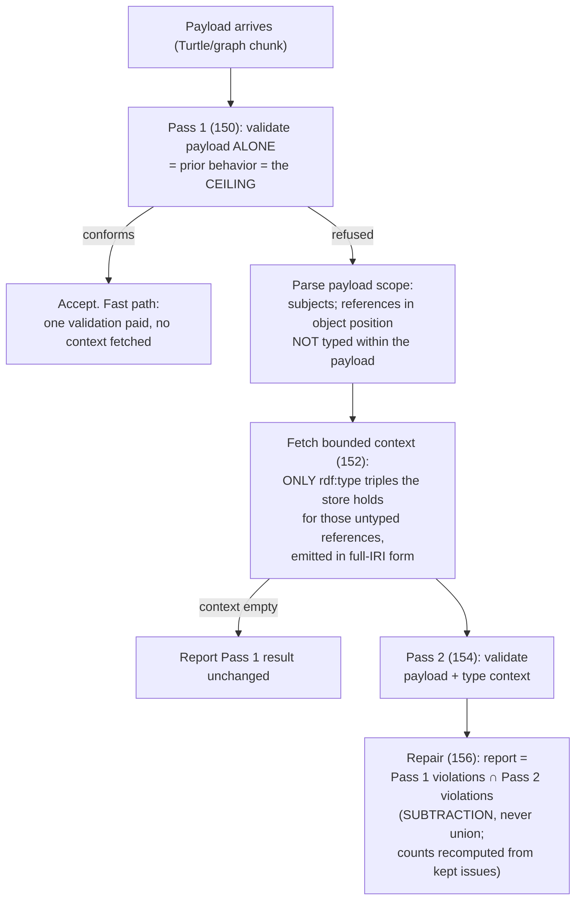
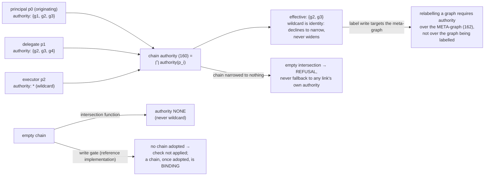

# Provisional Patent Application

## Governed Knowledge Store with Rollback-Surviving Signed Verdicts, Composable Graph Labels, and Bitemporally Versioned Validation

**Inventor:** Stephen C. Brown

**Filing type:** Provisional application for patent under 35 U.S.C. § 111(b)

---

## Field of the Invention

The present invention relates to database systems and knowledge-graph stores,
and more particularly to mechanisms for governing writes made to a knowledge
store by autonomous software agents: recording tamper-evident attestations of
policy decisions such that the record of a refused write survives the
transactional rollback of that write; routing refused writes to asynchronous
human decision with request-bound, expiring approval; composing
trustworthiness, freshness, durability, and obligation labels over named
graphs under a lattice algebra that never fabricates values for undeclared
members; versioning validation rules bitemporally so that data may be
validated and audited under the rules in force at any past time; and
validating partial write payloads such that the validation verdict cannot
depend on how a caller partitioned its data across writes.

## Background of the Invention

Knowledge stores are increasingly written to by autonomous software agents —
large-language-model-driven agents, ingestion pipelines, and other automated
writers — rather than exclusively by human operators. This shift exposes a
cluster of technical failures in conventional database and triple-store
architectures. The problems below are stated as technical problems in the
operation of the store itself, independent of any particular agent model.

**First, a refused write leaves no record.** In a conventional transactional
store, a write that violates a policy is rejected and its transaction is
rolled back. Everything performed inside that transaction — including any
attempt to log the rejection into the same store — is rolled back with it. An
accepted write leaves its own evidence in the facts it wrote; a refused write
leaves nothing at all. The question "did this policy ever actually stop
anything?" is then unanswerable from the store the policy lives in. Systems
that answer it commonly do so with a separate audit log, which raises the
second problem. Some relational engines offer *autonomous transactions* —
an inner transaction, opened from within the judged session, that commits
independently of the outer transaction's fate and is conventionally used to
persist audit rows across a rollback. That mechanism commits *during* the
judged scope, from what is in effect a separate session, and typically into
a log table that sits outside the governed data's temporal model and query
surface — which raises the same second problem.

**Second, audit logs are separable from the data they govern.** An external
audit log has an independent lifecycle, an independent access-control
surface, and no transactional relationship to the governed data. It can be
truncated, rotated, or lost without the governed store noticing. Further, an
unsigned audit entry is a claim, not an attestation: any process able to
append to the log can forge a record that a policy was satisfied. What is
needed is a decision record that (a) lives in the same store as the data it
judges, subject to the same temporal model and query language, (b) survives
the rollback of the very write it judges, and (c) is cryptographically bound
to what was decided, about what, by whom, on whose behalf, so that a bare
"satisfied" written into the record by an unauthorized writer is detectable.

**Third, approval workflows either hold locks or approve the wrong thing.**
When a policy requires human approval, a synchronous gate that waits for the
human converts an approval requirement into a lock on the store. Asynchronous
designs avoid the lock but commonly suffer two defects: an approval granted
for one request can be replayed against a modified request
("approve-then-change"), and an unserviced request either stays open forever
(deferred autonomy — nobody ever decided, and the system eventually acts) or
silently times out into a retryable state indistinguishable from a transient
error. There is no declared time at which the absence of a ruling becomes an
answer.

**Fourth, label composition fabricates values for undeclared members.**
Systems that attach trust, freshness, or sensitivity labels to data
partitions must compose those labels when a query spans partitions. Common
approaches default undeclared partitions to a top element (fail-open: an
unlabelled partition reads as fully trusted) or a bottom element (fail-closed
in a way that destroys utility: one unlabelled partition drags every query to
the floor), and they compare trust ranks from unrelated vocabularies as bare
integers, which is a category error that ships as a silent misordering.
Additionally, a naïve composition algebra fails at the empty dataset: if
"none of the present members declared anything" is used as the fold identity,
the homomorphism label(A ∪ B) = label(A) ⊓ label(B) is false at A = ∅, and
composition ceases to be associative.

**Fifth, validation verdicts depend on payload chunking.** Constraint
languages such as SHACL validate a data graph against shapes. When a large
dataset is submitted in chunks — as is unavoidable for realistic ingestion —
constraints that reference nodes described in other chunks (for example, a
class constraint on the object of a property) fail purely because the
referenced node's type declaration travelled in a different chunk. The same
facts, submitted whole, conform; submitted split, they are refused. The
verdict is then a function of an accident of framing rather than of
conformance. The inventor measured this failure at scale: in one production
ingestion, 2,315 of 7,638 symbols were refused at chunk 2 of 71, every one of
them a correct fact about an entity already typed in the store. Naïvely
adding store context to validation, however, creates the converse hazard:
context can make a merely-mentioned node into a validation target and refuse
a write for a shape violation on a node the write does not describe — a
tightening that refuses writes which previously succeeded.

**Sixth, the rules change under the trace.** Where governed data is
bitemporal — supporting "as of time T" queries — the rules that validate it
typically are not. Shape and ontology registries hold only the latest
revision, commonly via destructive overwrite. "Which shapes were in force at
time T" is unanswerable; a policy re-classed or retired after a recorded
enforcement window silently falsifies every replayed enforcement number for
that window; and an audit cannot distinguish "the runtime got it wrong at the
time" from "the specification moved afterwards."

The inventor is not aware of a system that addresses these problems
together, in-store, with the properties described herein. The SARC governance framework (G. Besanson,
"SARC: A Governance-by-Architecture Framework for Agentic AI," arXiv
preprint arXiv:2605.07728) is acknowledged as prior art for a *taxonomy* of
constraint classes, verification points, and audit decidability for agentic
systems; SARC describes a conceptual model and a checker over exported
traces. The present invention is directed not to that model but to concrete
in-store mechanisms — transactional staging orders, cryptographic bindings,
lattice algebras with explicit coverage, bitemporal rule registries, and
monotone multi-pass validation — that make such governance enforceable and
auditable inside a transactional knowledge store.

## Summary of the Invention

The invention comprises a governed knowledge store together with a cluster of
cooperating mechanisms. Each mechanism is independently useful; in
combination they form a store in which policy decisions, their records, the
labels on the data, and the rules of validation are all first-class,
tamper-evident, temporally coherent citizens of the store itself.

In one aspect, the invention provides a method of recording policy decisions
in a transactional store in which a write-policy gate evaluates governance
policies *inside* the write's transactional savepoint against the pending
post-state of that write; decision records ("verdicts") produced by the
evaluation are *staged* in memory on the store object rather than written
into the open savepoint; and after the savepoint resolves — whether by
release (commit) or rollback (denial) — the staged verdicts are flushed to
durable storage in a separate transaction. A denial's verdict thereby
survives the rollback of the very write it judged. Each verdict is a digital
signature-bearing attestation over a canonical field-ordered message bound to
an evidence hash computed over the policy identifier, the target, the
outcome, the attributed writer, and the principal chain in force; the
verdict's subject identifier is derived deterministically from the signature
so that re-recording an identical decision is idempotent by content. A
re-entrancy flag exempts the verdict-recording write itself from governance,
so that no policy can deny the recording of its own denial; and absence of a
signing identity yields no verdict rather than an unsigned one.

In another aspect, the invention provides a request-bound escalation router
in which a write refused under an escalating policy mints a durable decision
request whose identifier is derived deterministically from a hash over the
policy identifier and the target identifier, whose expiry is derived from
the policy's declared reversibility window, and which is satisfied only by a
decision record bound to the same request hash — so that an approval
recorded for one (policy, target) pair cannot authorize a different pair.
The "hold" is realized as the writing agent retrying rather than the engine
waiting; an unserviced request past its expiry is a denial rather than a
retryable timeout — in the reference embodiment a denial that stands for
that policy-and-target pair until a human records a decision or retracts
the request; a rejection outranks a concurrent approval; and a policy
declaring the escalation constraint class without declaring a reversibility
window is refused at definition time, when definition-time placement
validation is enabled, rather than being given a default.

In another aspect, the invention provides a multi-axis label lattice over
named graphs in which freshness, durability, and trust compose in a
narrowing direction (meet) and obligations compose in an accumulating
direction (join), under the single invariant that composition never widens;
trust values are data carrying the identity of the ranking chain that
ordered them, and composition across distinct chains returns an error rather
than comparing ranks as integers; a composed label is a pair of (fold over
declared values, coverage), where coverage includes a distinguished algebraic
identity element — the empty dataset — that no graph can declare, and whose
presence is necessary for the composition homomorphism to hold at the empty
set; undeclared is reported as undeclared, never fabricated; enforcement
floors treat less-than-full coverage as failure; label expiry is a
bitemporal de-declaration reading back as absence; and labels are stored
authoritatively as facts in a reserved meta-graph with denormalized cache
columns whose drift on the compared axes is detected and answered with
refusal rather than with a possibly-wrong answer.

In another aspect, the invention provides bitemporal versioning of
validation rules (shapes and ontologies), keyed on (name, valid-from), in
which loading a new version closes the prior version's validity interval
rather than overwriting it; as-of reads serve "the rules in force at time T
or transaction X"; validation may be performed under a past version's
semantics; and trace replay separately reports *fidelity* (the trace judged
against the specification as of the trace's own window: was enforcement
right then?) and *drift* (the specification then versus now: what has moved
since, stated as specification movement rather than misreported as trace
violation).

In another aspect, the invention provides a monotone two-pass contextual
validation method in which a submitted payload is validated alone first and
that verdict is a ceiling; only upon refusal is a second pass run with a
bounded context — type assertions held by the store for nodes the payload
references but does not type — added to the payload; and the reported result
is constrained by construction to be a subset of the first pass's
violations, so that enabling context can only remove refusals and never add
them, making the verdict independent of payload partitioning in the
permissive direction while never weakening any constraint a payload alone
would violate.

In further aspects, the invention provides: authority over named graphs
computed as the intersection along a principal-and-agent chain, where the
intersection function maps an empty chain to no authority, the write gate
applies the check once a caller adopts a chain (opt-in per caller, binding
once supplied), and relabelling a graph requires authority over the
meta-graph rather than over the graph being labelled; definition-time
placement validation refusing, at write time and against the pending
post-state, policies whose declared constraint class is incompatible with
their declared enforcement point, whose declared escalation class lacks a
declared window or timeout disposition, whose safety-critical fields are
ambiguous, or whose timeout disposition holds a forbidden non-deny value —
with refusal of a forbidden hosting-layer value as a further contemplated
rule (§ 7.2); and an audit reporting discipline that separates
*violation* (the trace contradicts the specification) from *incompleteness*
(the trace does not say enough to decide), refusing to let either stand in
for the other.

## Brief Description of the Drawings

**FIG. 1** is a block diagram of a governed knowledge store (100) according
to one embodiment, showing the write path (102), the transactional savepoint
(104), the write-policy gate (106) with its policy registry (108), the
staged verdict and request buffers
(110, 112), the post-resolution flush (114), the signing identity (116), the
named-graph fact table (120), the label meta-graph (122), the bitemporal
shape registry (124), and the escalation router (126).

**FIG. 2** is a sequence diagram of the rollback-surviving verdict mechanism,
showing a write staged inside a savepoint (104), policy evaluation against
the pending post-state, verdict staging (110), savepoint rollback on denial,
and the subsequent flush (114) of the signed verdict (118) in its own
transaction.

**FIG. 3** is a state diagram of the escalation router (126), showing the
minting of a deterministically identified, request-bound decision request
(128), the pending state with a declared expiry, transitions to approved,
rejected, and expired states, and the rules that expiry is a denial —
standing, in the reference embodiment, until a human decides or retracts —
and that rejection outranks approval.

**FIG. 4** is a diagram of the label lattice, showing the four axes —
freshness (130), durability (132), trust (134), and obligations (136) —
their composition directions, and the dataset fold (138) producing a
composed value paired with coverage (140).

**FIG. 5** is a diagram of the coverage composition rules, stated in
rule-node form, showing the distinguished Empty identity element and the
absorbing Partial element.

**FIG. 6** is a timeline diagram of the bitemporal shape registry (124),
showing successive versions of a named shape set with closed validity
intervals, an as-of read (142), and replay (144) reporting fidelity and
drift as separate outputs.

**FIG. 7** is a flowchart of the monotone two-pass contextual validation
method, showing the first pass over the payload alone (150), the fast path
on conformance, the bounded store-type context fetch (152), the second pass
(154), and the subset-constrained repair (156).

**FIG. 8** is a diagram of authority intersection along a principal chain,
showing per-principal authority sets, the chain intersection (160), the
empty-intersection refusal, the empty-chain behavior at the
intersection-function and write-gate levels, and the meta-graph authority
requirement for relabelling (162).

## Detailed Description of the Invention

The following description sets forth numerous specific details to provide a
thorough, enabling disclosure. It will be apparent to one skilled in the art
that the invention may be practiced without these specific details, and that
the specific technologies named — a particular systems programming language,
a particular embedded relational engine, a particular signature scheme, a
particular hash function, a particular graph data model — are exemplary
embodiments, not limitations. Alternative embodiments are identified
throughout and summarized in the section "Generalizations and Alternative
Embodiments."

### 1. System overview

FIG. 1 shows a governed knowledge store (100) according to one embodiment.



In one embodiment the store (100) is an embeddable bitemporal RDF/EAVT
knowledge-graph store implemented in the Rust programming language over the
SQLite relational engine. Facts are stored as rows (entity, attribute,
value, graph, transaction, valid-from, valid-to, operation) in a fact table
(120); IRIs are interned to integer term identifiers; named graphs partition
the fact space and are registered in a graphs table; retraction is logical
(closing a validity interval) rather than physical deletion; and every write
occurs within a transaction whose atomicity is provided by a savepoint
(104). Queries are served through a SPARQL evaluator operating over the same
connection, including as-of temporal queries by valid time or by transaction
identifier.

Nothing in the mechanisms below depends on these choices. In alternative
embodiments the store is any transactional store supporting nested or
savepoint-style transactions — including client-server relational databases,
LSM-tree stores with write batches, or log-structured stores with
speculative apply — and the data model is any entity-attribute-value, RDF,
property-graph, or document model in which a "fact" has an identifiable
subject, predicate-like attribute, value, partition, and temporal validity.

Governance policies are themselves ordinary facts in the store: a policy
entity carries a target type, a claim expressed as a boolean query (in one
embodiment, a SPARQL ASK with a `$target` placeholder), an effect (deny,
require-approval, escalate, warn, record, allow, throttle — of which only
the first three block, and only blocking effects are evaluated, at the
write gate in the reference implementation), optionally an evidence
probe (a second boolean query asking whether evidence to judge exists at
all), and constraint metadata (constraint class, verification point,
reversibility window, timeout disposition, hosting layer). Because policies
are facts, they are bitemporal, queryable, attributable, and governed by the
same machinery as everything else — which is a deliberate property, not an
implementation convenience.

### 2. Verdict permanence across rollback (FIGS. 1–2)

#### 2.1 The problem restated as an ordering problem

A denied write is rolled back; that is what denial means in a transactional
store. A verdict written inside the same savepoint is rolled back with it.
The verdict of a denial is precisely the one worth keeping, because an
accepted write leaves its own evidence in the facts it wrote while a refused
one leaves nothing at all. The entire design of this mechanism is therefore
an ordering: decisions are *computed* inside the transaction (where the
pending post-state is visible) but *persisted* outside it (where the
rollback cannot reach them).

#### 2.2 Mechanism operation

FIG. 2 illustrates the sequence.



In one embodiment the operation proceeds as follows:

1. **Open a savepoint (104).** The write path (102) opens a named savepoint
   on the store's connection. In one embodiment manual savepoint commands
   are used rather than a scope-guard abstraction, specifically so that a
   shared (read) borrow of the connection remains available to the query
   evaluator while the savepoint is open — the gate must run read queries
   mid-write.

2. **Stage the write.** The transaction row and the proposed fact rows are
   inserted inside the savepoint. Because they are staged on the same
   connection, subsequent reads on that connection observe the *pending
   post-state*: the store as it would be if this write committed.

3. **Evaluate the gate (106) against the pending post-state.** For every
   entity the write touches, the gate resolves the entity's active types and
   looks up applicable action-boundary policies in a cached registry (108)
   indexed by target type, so that a write touching no governed type runs
   zero claim evaluations. For each applicable blocking policy: if an
   evidence probe is declared and finds no evidence, the outcome is
   `unknown` — a three-valued logic in which "no evidence yet" is distinct
   from both satisfied and unsatisfied, and does not block. Otherwise the
   claim query is run with the target bound; a true result is `satisfied`, a
   false result `unsatisfied`. Evaluating against the pending post-state is
   essential: a policy of the form "every X must carry property P" must
   accept a write that adds X and P together, and must refuse a write that
   removes P from an existing X — both judgments require seeing the write's
   effect, not the pre-state.

4. **Stage, do not write, the decisions.** Every outcome the gate computes
   for a blocking policy — satisfied, unsatisfied, and unknown — is
   recorded as a pending verdict in an in-memory buffer (110) held on the
   store object. Advisory effects (warn, record, allow, throttle) are not
   evaluated at the write gate in the reference implementation — there is
   nothing to enforce there — and accordingly stage no verdict; evaluating
   advisory policies at the gate and recording their outcomes is an
   alternative embodiment. Escalation requests are
   staged into a parallel buffer (112) (see § 3). Nothing is written to the
   fact table for these decisions inside the savepoint.

5. **Resolve the savepoint either way.** If every blocking policy is
   satisfied (or unknown, or covered by a standing approval), the savepoint
   is released and the write commits. If any blocking policy is unsatisfied,
   an error is returned and the savepoint is rolled back; the store is left
   byte-identical to before the call.

6. **Flush after resolution (114).** On *both* paths — after the release,
   and after the rollback — the store flushes the staged buffers: the
   pending verdicts are converted to signed verdict facts (§ 2.3) and
   written by a fresh transaction; staged decision requests are minted
   likewise (§ 3). Because the flush occurs after the savepoint has
   resolved, the accept case and the denial case record identically, and a
   denial's verdict survives the rollback of the write it judged.

7. **Failures in the flush are swallowed.** A verdict that cannot be
   recorded must not convert a successful write into a failed one, nor a
   policy denial into a different error. In one embodiment the flush's
   transaction result is deliberately discarded; the gate's own result is
   what the caller receives.

#### 2.3 The verdict as a signed attestation

A verdict written as a bare fact ("policy P was satisfied for target T")
would be forgeable by anyone able to write a fact. The verdict is therefore
an *attestation*: a record carrying a digital signature by a registered
verifier identity, verifiable by any reader.

In one embodiment the verdict record (118) comprises facts asserting, on a
single subject: a type declaration (Verdict); the policy identifier; the
target reference; the outcome (one of `satisfied`, `unsatisfied`,
`unknown`); an evidence hash; the verifier name; the signature; a tier tag;
and, when present, the attributed writer and the principal chain.

**The evidence hash** is computed as a cryptographic digest — in one
embodiment SHA-256, rendered as `sha256:<hex>` — over a canonical
concatenation:

```text
predicate-id | target-ref | outcome | writer | principal-chain
```

where `writer` is the actor presented with the write (the empty string when
none was presented) and `principal-chain` is the comma-joined
principal-and-agent chain in force (§ 7.1). Two properties of this choice
are deliberate. First, the hash is *not* a hash of graph state: the
evidence backing a verdict is the result of a query over the store, which
has no stable serialization, and a hash that moved with unrelated facts
would make every verdict spuriously stale. The hash binds exactly what the
verdict asserts, which keeps the binding honest about its own scope.
Second, the hash *includes attribution*: a signature that stopped at the
outcome would leave "who was refused" swappable under a valid seal. Because
a denial rolls back its delta (deliberately), the persisted verdict is, for
a refusal, the *only* record naming the refused actor — the attempt is not
kept; who made it is.

**The signed message** is a canonical, field-ordered, versioned byte string:

```text
v1 | predicate-id | target-ref | outcome | evidence-hash | tier | verifier
```

Deterministic field order makes the signature reproducible: any verifier
re-derives the exact message from the verdict's stored fields and checks the
signature against the registered public key — checked, not trusted. In one
embodiment the signature scheme is Ed25519 and the tier tag is `committed`,
denoting that the gate evaluated against the durable store as it would
stand upon commit — the savepoint-staged post-state on the durable
connection — as distinct from an in-memory read model or approximation. In
alternative embodiments any digital signature scheme
may be used — ECDSA, RSA-PSS, post-quantum schemes such as ML-DSA, or, in
deployments where asymmetric signing is unavailable, an HMAC under a key
held by a trusted recorder — and the canonical message may be any
deterministic serialization (length-prefixed fields, canonical CBOR,
canonical JSON) provided it is injective over the signed fields.

**Idempotent subject derivation.** The verdict's subject identifier is
derived from a prefix of the signature (in one embodiment, the first 32 hex
characters), so that re-recording the same decision over the same evidence
maps to the same subject and is idempotent *by content* rather than
accumulating one record per evaluation. Any deterministic function of the
signature or of the signed message (a further hash, a truncation) serves in
alternative embodiments.

**No identity, no verdict.** When the store holds no signing identity
(116), no verdict is produced — never an unsigned one. An unsigned
"satisfied" in the record is exactly the forgeable claim the mechanism
exists to exclude, so its absence is preferred to its presence. In one
embodiment verifier public keys are registered by human-authored
registration facts, and the store's own identity never self-registers,
concentrating trust in a small human-owned surface.

**Three-valued outcomes.** The `unknown` outcome is recorded, not skipped.
"No evidence yet" and "never evaluated" are different facts, and an absent
verdict would make the gate look as though the policy did not apply. The
audit layer (§ 7.3) accordingly treats `unknown` as neither a pass nor a
failure.

#### 2.4 Re-entrancy: the gate must not judge its own record

Writing a verdict is itself a write, and the gate would evaluate it. Left
alone this is at best wasted work and at worst a livelock of principle: a
policy targeting the verdict type would deny the verdict that records its
own denial, and that denial would stage a verdict, without end. In one
embodiment the flush sets a `recording-verdicts` flag on the store for the
duration of the verdict write; the gate, the authority check, the placement
check, and the constraint-enforcement hooks all honor the flag and pass the
write through ungoverned. This is a deliberate hole and a narrow one: it
applies only to facts constructed by the verdict-recording module itself and
only for the duration of that write. The same flag suppresses recursive
flushes. In alternative embodiments the exemption is realized by writing
verdicts to a reserved partition excluded from policy targeting, by a
dedicated internal writer identity exempted by construction, or by a
separate connection whose writes bypass the gate; the essential property is
that the recording of a decision is not itself subject to the decided-upon
policy surface.

#### 2.5 Why each design choice

- *Staging on the store object rather than emitting where computed*: the
  computation site is inside the savepoint; the emission site must be
  outside it. A buffer owned by the store is the smallest structure that
  crosses that boundary.
- *A separate transaction for the flush*: the verdict must not extend the
  judged write's atomicity envelope in either direction. A verdict that
  committed with the write would vanish with its rollback; a write held open
  until the verdict landed would couple data availability to audit
  availability.
- *Recording satisfied outcomes too, not only denials*: liveness and
  two-sidedness of a policy (has it ever fired? has it ever passed?) are
  promotion gates for advisory-to-enforcing transitions (§ 5.3), and both
  require the passing records. In the reference implementation the gate
  evaluates and records outcomes only for blocking policies, and the
  promotion analysis of § 5.3 consumes recorded enforcement traces — a
  separate artifact — rather than the verdict facts; an embodiment that
  evaluates advisory policies at the gate and feeds their verdicts to the
  promotion analysis directly is contemplated.
- *Swallowing flush failures*: the alternative converts an audit-plane
  failure into a data-plane failure, which inverts the dependency the design
  intends.

The closest prior mechanism for a rollback-surviving audit record — the
autonomous transaction offered by some relational engines — is distinguished
as follows. An autonomous transaction commits *during* the judged scope,
from what is in effect a separate session, and typically into a log table
outside the governed data's temporal model and query surface; its record
can land even though the judged scope has not yet resolved, and it lives
apart from the data it judges. The present mechanism buffers the decision
and writes it only *after* the judged scope has resolved — commit and
rollback recording identically — and lands it in the same governed,
bitemporal, queryable store as the data it judges, as a signed,
content-idempotent attestation subject to the same temporal semantics as
everything else.

### 3. Request-bound escalation with expiry-as-denial (FIG. 3)

#### 3.1 The problem

Policies with effects such as `require-approval` and `escalate` fail closed
at a write gate — but a refusal an operator cannot act on is a worse control
than an honest advisory, because it looks like governance while functioning
as an outage. The gate is synchronous; holding its transaction open while a
human decides would convert an approval gate into a lock on the store.

#### 3.2 Mechanism operation



In one embodiment:

1. **Minting.** When a write is refused under an escalating policy and no
   request yet exists, the gate stages a pending request (112) — staged, not
   written, for the same reason as verdicts: the gate runs inside the
   savepoint that this refusal is about to roll back, and a request written
   in place would vanish with it, leaving the operator a refusal with no
   request to act on, which is exactly the state the router exists to end.
   The post-resolution flush mints the durable decision request (128): a
   typed record carrying the policy identifier, the target identifier, an
   evidence hash, an expiry, and optionally the operator group routed to.
   The routed-group field is part of the record's schema but is unexercised
   on the reference implementation's in-store flush path, which supplies no
   group; embodiments that deliver requests to operator groups populate it.

2. **Deterministic request identity.** The request's subject identifier is
   derived from a cryptographic digest over `policy-id | target-id` (in one
   embodiment, SHA-256, taking a fixed-length substring of the hex digest).
   On the common path a retry while the request is pending stages nothing
   further — the router's ruling is simply returned. The deterministic
   identity matters in the edge cases: where a prior flush failed to land
   the request, or where several escalating policies cover one target
   across attempts, re-minting maps to the *same* subject and updates the
   existing request rather than accumulating one per attempt.

3. **Expiry from the declared window.** The request's `expiresAt` is
   computed as the escalation time plus the policy's *declared*
   reversibility window. There is deliberately no default window: a policy
   declaring the escalation constraint class at the action boundary without
   declaring one is refused at definition time by the placement check
   (§ 7.2), when that check is enabled — it is opt-in in the reference
   implementation, disabled by default. The definition-time rule is scoped
   by declared *class*, while the router is entered by declared *effect*:
   a policy whose effect escalates but whose declared class is hard or
   soft, or absent, is not reached by the rule even with the check
   enabled. Either way, a policy arriving at the router without a window
   is given a zero window — treated as already expired rather than being
   handed an invented default — which, combined with the standing reading
   of expiry (item 8), denies the pair immediately and permanently unless
   and until a human records a decision or retracts the request. The
   rationale: an escalation without a bound is not oversight, it is
   deferred autonomy — there is no time by which the absence of a ruling
   becomes an answer.

4. **The hold is the agent retrying, not the engine waiting.** The refusing
   error message names the open request, its expiry, and precisely what
   would un-refuse it. No transaction is held; no scheduler or notifier is
   part of the store. Delivering the request to the routed group is a
   consumer of the record, not a function of the store.

5. **Request-bound approval.** A human records a decision fact carrying an
   outcome, the decider's identity, and an evidence hash. The decision
   satisfies the request only when its evidence hash equals the request's.
   The hash is a digest over the policy identifier and the target
   identifier, so the binding is to the request's *identity*: an approval
   recorded for one (policy, target) pair cannot authorize a different
   pair — a different target or a different policy changes the hash, and
   the approval no longer applies. The binding uses the same mechanism as
   the verdicts' evidence hash rather than a second one, and is scoped to
   exactly what the request identifies: widening it to graph state would
   make every approval spuriously stale the moment anything unrelated
   changed. The binding does not extend to the *contents* of the retried
   write — an approval for the pair permits the next attempt whatever its
   payload. In another embodiment the digest additionally covers a
   canonical encoding of the proposed write's payload or delta, so that
   changing what would be written voids the approval and
   approve-then-change is defeated in the payload dimension as well.

   In the primary contemplated embodiment the decision fact is itself an
   authenticated record: a signed attestation under § 2.3's scheme by a
   registered decider identity, or a fact written under a principal chain
   holding authority over the surface where decisions live, so that only
   an authenticated decider can produce a decision the router will honor.
   In the reference implementation as it stands, the router accepts any
   decision fact bound to the request's hash without verifying a
   signature; authenticating deciders is there delegated to the write
   path's own controls over the graphs holding decision facts, and the
   signed-decision embodiment closes the gap in which the refused writer
   could record the approving decision itself.

6. **Resolution on the next attempt.** The next write attempt consults the
   router before refusing. The ruling is one of: *Approved* (proceed);
   *Rejected* (refuse, naming the decider and outcome); *Pending* (refuse,
   naming the expiry); *Expired* (refuse). Only an explicit approval
   permits; pending and expired are both refusals, because reading either as
   a pass is the default-allow-under-load failure the design excludes.

7. **Rejection outranks approval.** When decisions with both outcomes exist
   over the same evidence — two humans disagreeing — the router returns the
   rejection. A disagreement about whether to permit something is not a
   state to resolve by row order, and the safe reading of it is "no."

8. **Expired is a denial, not a timeout — and in the reference embodiment
   a standing one.** Past `expiresAt`, an unserviced request is a denial: a
   declared default-deny, not a transient error to retry through. Because a
   request is minted only when none exists for the (policy, target) pair,
   and an existing request past its expiry resolves to the expired ruling
   on every subsequent attempt, retrying does not open a new request: the
   pair remains denied until a human acts — by recording a decision bound
   to the request's hash, which the router consults before checking expiry
   and honors even after it, or by retracting or superseding the request.
   This realizes the principle that under operator unavailability the
   constraint must deny, because default-allow converts the constraint
   into a no-op exactly under the load that made it matter. In an
   alternative embodiment, the first attempt after expiry retracts the
   expired request and opens a new one with a fresh window, so that expiry
   bounds each round of escalation rather than ending escalation for the
   pair.

In alternative embodiments the request and decision records live in any
durable store queryable by the gate; the digest is any collision-resistant
hash; the window is expressed in any time unit or as an absolute deadline;
decision authentication is realized by any signature scheme or
authenticated write path (item 5); and the router may be consulted at
admission points other than a write gate (tool dispatch, job scheduling,
deployment promotion) wherever an asynchronous, request-bound, expiring
human approval over a refused automated action is required.

### 4. The label lattice: composition never widens, coverage as fold identity (FIGS. 4–5)

#### 4.1 The axes and the invariant



In one embodiment each named graph may declare a label on four axes:

- **Freshness (130)**: `stale < recomputing < fresh`, a total order composed
  by meet (minimum). `recomputing`, when collapsed onto a binary scale,
  collapses to stale, never to fresh — the conservative reading cannot
  overstate. Freshness is *declared by a producer, never observed or
  synthesized by the store*.
- **Durability (132)**: `soleRecord < reproducible < backed` — recoverability
  if this store is lost — composed by meet.
- **Trust (134)**: a value that is *data*, comprising the trust value's own
  identifier, its numeric rank, and the identifier of the *ranking chain*
  that ordered it. Composition is meet (the lesser rank) *within one chain*;
  meet across different chains returns an error naming both chains. Two
  ranks from different chains are not a small number versus a large one;
  comparing the integers is a category error, and doing it silently is
  exactly how a "learned heuristic outranks canonical source" defect ships.
  The trait realizing meet is therefore fallible by signature, even though
  three of the four axes can never fail — one fallible interface keeps the
  folds uniform.
- **Obligations / policy class (136)**: a set of obligation tokens (`pii`,
  `no-export`, …) composed by *join* (set union), after the manner of
  information-flow lattices. Incomparable sets are the normal case and block
  nothing; the join always exists on a powerset.

The single invariant across all four axes is **composition never widens**: a
composed result permits or claims no more than any input. The invariant is
deliberately named instead of the operator, because the operator flips
direction by axis — freshness and trust narrow by meet, obligations
accumulate by join (a larger obligation set is a *stronger* restriction; the
set grows so that permission does not). A practitioner who remembers "labels
are a meet" will union obligations in the widening direction and quietly
drop a restriction; naming the invariant prevents the sign error.

#### 4.2 Undeclared is not a lattice value; Coverage and its identity

Every graph in every pre-existing deployment is unlabelled, so the default
decides backward compatibility — and neither pole is right. Defaulting
undeclared to top fail-opens trust (an unlabelled graph reads as fully
attested); defaulting to bottom drags every existing query to the floor. The
invention therefore makes a composed label a *pair*: the fold over the
*declared* labels, plus a **coverage** value (140) saying how much of the
dataset declared anything on that axis. Undeclared members contribute to
coverage and never to the value.

Coverage takes four values — `Empty`, `None`, `Partial`, `Full` — composed
as shown in FIG. 5:



`Empty` — the coverage of a dataset with no graphs at all — is the
distinguished algebraic identity, deliberately distinct from `None` (graphs
present, none declared anything), and the distinction is load-bearing in two
directions. First, without it the homomorphism

> label(A ∪ B) = label(A) ⊓ label(B)

is *false* at A = ∅: with `None` as the identity, `None ∘ Full` yields
`Partial` while label(∅ ∪ B) must equal label(B) — folding then stops being
associative, and every derived label becomes order-dependent. Second,
collapsing the other way — treating "no graphs" as top — is the fail-open
the design refuses. `Empty` is a fourth value beyond the natural
{full, partial, none} vocabulary; it is the algebraic identity, and *no
graph can declare it*. In one embodiment the homomorphism (that folding raw
members equals composing already-composed labels) is pinned by
property-based tests; the fold and the pairwise composition are two
implementations sharing one rule — "undeclared contributes to coverage,
never to value" — whose agreement is itself pinned by the property-based
tests, because if the two ever disagreed, associativity would fail
silently.

A composed label whose value is absent is reported as *undeclared* — never
as a fabricated fresh/top/bottom. Silence must not flatter.

#### 4.3 Enforcement floors, and the conservative dataset fold

A deployment may configure floors: minimum freshness, minimum trust rank
*together with the chain the floor is expressed in* (a rank floor without a
chain is refused as configuration error), and denied obligation tokens.
Enforcement is fail-safe while reporting stays honest: under a configured
freshness or trust floor, an *undeclared* axis fails the floor — absence is
not read as permission — while read-back still reports undeclared rather
than inventing a value. Denied obligation tokens are matched against the
*declared* obligation set: in the reference implementation a dataset whose
obligations axis is wholly undeclared is not refused by a token floor,
there being no declared token to match; refusing an undeclared obligations
axis under a token floor is an alternative embodiment. Floors
refuse the *query* and name the specific member graph that dragged the
label down (the fold says the dataset is stale; only the members say which
one); they are expressly not access control — a caller naming a graph
directly still reads it, and no rows are hidden.

The dataset fold is computed once per query over the dataset's member
graphs — O(|dataset|), never O(|rows|) — and is conservative by
construction: a dataset containing a stale graph is labelled stale even if
no returned row came from that graph. Per-row labelling is rejected not as
a cost matter but as a semantic one: RDF merge semantics collapse a triple
present in three graphs into one solution, and projecting the graph to
carry a per-row label would turn one solution into three — different
results, not slower ones.

#### 4.4 Label expiry as bitemporal de-declaration

A label may be declared with an expiry (valid-to). After expiry the whole
declaration reads back as *undeclared* — absence, not falsity: expiry never
manufactures an "unknown" value and never preserves the last value as if
still asserted. Because labels are ordinary bitemporal facts, "what was this
graph's label at time T" remains answerable after expiry; only the *current*
reading becomes undeclared. Combined with § 4.3, an expired freshness label
under a configured floor fails closed automatically — a producer that stops
re-asserting freshness stops being served.

#### 4.5 Hybrid storage: authoritative facts, cached columns, drift refusal

Labels are stored twice, in one savepoint: authoritatively as facts in a
reserved meta-graph (122), and denormalized into nullable cache columns on
the graph registry row (freshness rank, durability rank, trust rank, trust
chain, obligation tokens, label transaction, label expiry). The facts are
authoritative because pure columns lose history, governance, and
queryability — the reasons to put labels in a knowledge graph at all; the
columns exist because the dataset fold runs at query entry, where a nested
query evaluation on the same connection would be a re-entrancy hazard.
Writing both under one savepoint means the two cannot diverge through
partial failure; labelling an unregistered graph is refused (an update
matching no registry row would otherwise silently create permanent drift).

Reads defend the cache's honesty in three ways. (a) A **drift sweep**
recomputes labels from the meta-graph facts and reports disagreements
(graph, axis, authoritative value, cached value); in the reference
implementation the sweep compares the freshness value, the durability
value, the trust *chain* identity, and the obligation token set — the
cached trust *rank* itself is not among the compared fields, and a
current-label read serves the cached rank subject to checks (b) and (c)
below; a sweep extended to every cached field, the rank included, is an
alternative embodiment. The facts are the source of truth and a non-empty
report means the cache is wrong, never the reverse. (b) A cached trust rank with no corresponding trust fact,
or a half-written trust cache (rank without chain), is answered with an
**error**, not with either value presented as agreed. (c) If the chain that
ranks a cached trust value has been *redefined* since the cache was written,
the read refuses: a rank means nothing outside the chain that declared it,
so the store refuses to answer rather than answering wrongly. The general
principle — a derived cache that detects disagreement with its source
refuses rather than lies — is claimed as such.

In alternative embodiments the axes are any finite set of partially ordered
label domains with declared composition direction per axis; trust chains
generalize to any family of mutually incomparable total or partial orders
whose members carry their order's identity; the meta-graph generalizes to
any authoritative record co-located with the governed data; and the cache
generalizes to any denormalization with write-coupled consistency and
read-time drift refusal.

### 5. Bitemporal shape versioning, as-of validation, and the fidelity/drift split (FIG. 6)

#### 5.1 The asymmetry being removed

The store's *data* is bitemporal; without this mechanism, the *rules that
validate it* are not. Conventional shape/ontology registries hold one row
per name and overwrite it on load — versioning that is not merely absent but
*discarded* — and no event records that the rules changed. "Which shapes
were in force at time T" is then unanswerable, and replayed enforcement
statistics are silently computed against today's rules.

#### 5.2 The versioned registry



In one embodiment shapes and ontologies share one versioned implementation
(identical schemas, identical problem — one implementation rather than two
that can drift). Rows are keyed (name, valid-from) with valid-to and a
transaction watermark. Loading a version **closes the prior open row**
(setting its valid-to to the load timestamp, restricted to rows with
strictly earlier valid-from) and inserts a new open row, under a savepoint;
the two versions form an adjacent, gapless pair of half-open intervals so an
as-of read lands on exactly one. A reload at the same instant *replaces*
that instant's version — there is no meaningful ordering within one
timestamp. Removal closes, never deletes: the retraction-never-deletes
discipline the fact table already has. Every load and removal emits a
registry event carrying the transaction watermark, closing the hole in the
audit spine — before this, the append-only event log had no record that the
rules changed.

As-of reads (142) serve the rules in force at a valid time (interval
containment) or at a transaction (latest version per name at or before the
watermark). A combined-shapes as-of read feeds the validator, which takes
serialized shape text and is version-agnostic: versioning lives entirely in
*which text is selected*, so the validation engine is untouched, and a
content-hashed validator cache makes two versions two cache keys that
coexist. Validation endpoints gain optional as-of parameters defaulting to
now — zero behavior change for existing callers. In a contemplated
embodiment a *declared shape version* supplies exactly the stable reference
for a verdict (§ 2.3) to cite, where hashing raw graph state was rejected
as unstable; the reference implementation's verdict record does not yet
carry a shape-version field.

#### 5.3 Replay: fidelity separated from drift

Recorded enforcement traces (which policies were evaluated, with what
outcome, with what response — in the reference implementation an
append-only record consumed by the audit and replay passes as a separate
artifact from the verdict facts) can be replayed over a recorded window to
answer
"if this rule started blocking, what would it have stopped?" — a promotion
gate for advisory-to-enforcing transitions, measuring liveness (did it ever
fire?), two-sidedness (did it record both outcomes?), new blocks,
recoverability (did refused targets ever see later success?), and blast
radius (distinct targets).

Without versioned rules, replay evaluates against current Σ (the current
specification), which is the right *drift check* but silently falsifies the
historical numbers when Σ has moved. The invention computes both, reported
in separate outputs (144):

- **Fidelity**: the trace judged against Σ *as of the trace's own window* —
  was enforcement right *then*? The per-rule statistics are computed under
  Σ-then.
- **Drift**: Σ-then compared to Σ-now, field by field (class, verification
  point, effect, hosting layer, and *presence* — a policy declared then and
  absent now is reported as presence movement rather than skipped), each
  difference stated *as specification movement*, never counted as a trace
  violation: a policy re-classed after the window did not make the runtime
  wrong at the time it ran.

A live-Σ replay produces an empty drift output, where emptiness means "not
asked," never "nothing moved." Outcomes recorded as `unknown` are counted as
neither satisfied nor unsatisfied — folding an unevaluated check into either
column is how it comes to read as a passing one.

In alternative embodiments the versioned registry pattern applies to any
rule artifact consumed by a governed system — schemas, access-control
policy bundles, feature-flag rule sets, ML model configurations — wherever
"validate/decide under the rules in force at T" and "separate historical
correctness from subsequent rule movement" are required; the storage is any
table or log supporting interval keys; and the trace is any append-only
record of rule evaluations.

### 6. Monotone two-pass contextual validation (FIG. 7)

#### 6.1 The measured defect

Validating a submitted payload in isolation is defensible for constraints
about what a write *asserts* and wrong for constraints about what it
*references*: a class constraint on an object property asks "is this value a
Foo?", and the answer lives in the store, not in the request body. A correct
write is refused whenever the referenced node's type triple happened not to
travel with it — making the verdict a function of how the caller
*partitioned* its triples. The same facts, submitted whole, conform;
submitted split across two writes, the second is refused. Measured at scale
on a chunked production ingestion: 2,315 of 7,638 symbols refused at chunk 2
of 71, every one a correct fact about a module already typed in the store. A
validator whose answer depends on submission order is not reporting
conformance; it is reporting an accident of framing.

A natural first approach — add store context and re-validate — has a converse hazard,
also measured: adding a referenced node's type can make that node a
*target* of a node shape, whose other constraints (e.g. a minimum-count on
some property) the payload has nothing to satisfy, refusing a write for a
shape violation on a node it merely mentioned. In a soak test over a real
65 MB projection split into 5 chunks, a first implementation that filtered
violations by payload subject *newly refused* chunk 4 — the tightening
hazard arrived at while trying to avoid it, despite careful reasoning. The
invention's answer is structural rather than reasoned: a subset constraint
that makes the hazard unrepresentable.

#### 6.2 Mechanism operation



1. **Pass 1 — the ceiling (150).** The payload is validated alone. This is
   exactly the prior, context-free behavior. If it conforms, it is accepted
   on the fast path: no context is fetched and only one validation is paid.
   Only a payload that was already being refused pays for anything further.

2. **Scope extraction.** The payload is *parsed*, not scanned: string
   matching would miss prefixed type forms, full-IRI type predicates, and
   predicate lists, each error falling in the unsafe direction (a reference
   wrongly believed typed means no context is fetched and the write is
   refused exactly as before). Extraction yields the payload's subjects and
   its *untyped references* — identifiers appearing in object position that
   the payload itself does not type.

3. **Bounded context (152).** For each untyped reference, only the type
   assertions the store holds are emitted, in fully-qualified form so the
   context cannot depend on the payload's prefix declarations. Types only,
   deliberately: pulling each referenced node's full description would turn
   one write into an unbounded read, and every extra triple is another
   chance to make a node the payload does not own into a validation target.
   A class constraint needs the type and nothing else. References unknown to
   the store are skipped silently — such a constraint will fail on its own
   merits.

4. **Pass 2 and subset repair (154, 156).** The payload plus context is
   validated, and the reported result is the Pass 1 violations *minus* those
   the context resolved — computed as an intersection keyed on
   (focus node, constraint component, path, value). Subtraction, never
   union: an issue present only in the augmented run is something the
   *context introduced* (a referenced node becoming a target), and reporting
   it would refuse a write for a fact it does not assert. Those are dropped
   *by construction*, not by a targeting filter that has to be right.
   Violation and warning counts are recomputed from the kept issues (a
   result claiming non-conformance with zero violations would be a refusal
   with nothing to show). The issue key deliberately excludes the source
   shape identifier, because validation engines may label anonymous property
   shapes with fresh blank-node identifiers per run, which would make every
   issue unique and silently disable the repair while refusal-side tests
   kept passing.

The monotonicity claim is therefore the *shape of the code*, not an argument
about it: there is no code path on which a violation the context-free
behavior did not report can be returned. Enabling context can only remove
refusals, never add them; the verdict becomes independent of payload
partitioning in the permissive direction while every constraint a payload
alone would violate is preserved.

In alternative embodiments the constraint language is any graph or record
constraint system (SHACL, ShEx, relational CHECK-like constraints over
document stores); the "context" is any bounded, deterministic projection of
the authoritative store keyed by the payload's unresolved references (types,
keys, existence flags); and the subset constraint is enforced by
intersection over any run-stable issue identity.

### 7. Supporting mechanisms

#### 7.1 Authority intersection along principal chains (FIG. 8)



Writes may carry a principal-and-agent chain, ordered outermost-first
(originating principal … executor). The effective authority over named
graphs is the **intersection** along the chain (160), so appending a
delegate can only narrow what may be written — the defense against authority
escalation via a sub-agent whose own credentials are broader than its
caller's: the executor's credentials are not what applies; the intersection
is. A wildcard authority is the identity of intersection: it declines to
narrow and can never widen, which is how a single-tenant deployment (every
principal holds the wildcard) behaves exactly as before the mechanism
existed. Two rules operate at two deliberately distinct levels. At the
level of the intersection *function*, an **empty chain** yields *no*
authority, not the wildcard — the fold's identity is deliberately not the
wildcard, so no code path can derive permission from an absence of
principals. At the level of the write *gate*, the reference implementation
applies the authority check only when a caller has adopted a chain, and
only when authority enforcement is enabled (it is opt-in, disabled by
default): an unattributed write is the shape every pre-existing caller has,
and turning attribution into a hard requirement beneath a running
deployment would break every one of them at once. What the gate guarantees
is that a chain, once supplied, is *binding* — adopting attribution is
opt-in per caller and cannot silently widen. In another embodiment the
gate refuses unattributed writes outright, realizing "nobody said who is
acting must not mean anybody may act" at the gate as well as within the
function. Separately, an **empty intersection** is a refusal, never a
fallback to any single link's authority, since the fallback is precisely
the escalation the rule exists to stop. A principal with no declared authority
grant holds nothing: absence read as permission is how an access-control
layer becomes decorative. Refusal messages name the chain, the graph, and
what the chain actually holds, so the narrowest link is identifiable in one
line. Authorities are themselves facts in the store; the authority meet is
the same lattice interface as § 4 (composition never widens, stated once).

The consequence for labels (162): label writes target the reserved
meta-graph, and the authority check applies to the graph *being written* —
the meta-graph — not the graph being labelled. Relabelling therefore
requires authority over the meta-graph. That is the point: otherwise a
tenant with authority over its own graph relabels itself to the top trust
value.

#### 7.2 Definition-time placement validation

A constraint-class ↔ verification-point compatibility matrix (per the SARC
taxonomy: hard constraints only at points that decide admissibility before
or during dispatch; soft constraints only where completed-action data
exists; escalations only where a human ruling has a seam) is enforced *at
definition time*: when a write defines or amends a policy, the check runs
inside the same savepoint against the pending post-state, and a malformed
policy is refused with a reason naming the specific incompatibility. In the
reference embodiment the matrix is:

| Constraint class | Permitted verification points |
| ---------------- | ----------------------------- |
| hard | pre-action gate, action-time monitor, tool layer, policy layer |
| soft | action-time monitor, post-action auditor |
| escalation | pre-action gate, post-action auditor |

A hard
constraint declared at a post-action auditor is the canonical catch: it
reads as governed, validates against every field-level shape, and is
evaluated only after the action it was meant to prevent — present,
plausible, and incapable of failing. Further definition-time rules: an
action-boundary policy must declare a class and a point; a policy declaring
the escalation class at the action boundary must declare a reversibility
window and a timeout disposition (§ 3.2); the only permitted timeout
disposition is deny; and a policy whose safety-critical field resolves to
*multiple* distinct values (e.g., two constraint classes concurrently
asserted) is refused as ambiguous rather than resolved by row order — a
re-class must retract the stale value in the same transaction that asserts
the new one. The design further reserves no "prompt-layer" hosting value —
a constraint expressed as an instruction a model may reinterpret is not
enforcement — and contemplates refusing, at definition time, a policy
declaring a hosting layer outside the permitted vocabulary. In the
reference implementation that hosting-layer refusal is design intent rather
than operative behavior: the read that assembles a policy's placement
metadata does not project the hosting-layer field, so the forbidden-layer
branch is unreachable from the write path, while the timeout-disposition
refusal is operative. In another embodiment the hosting-layer field is read
back like the others and the refusal fires as described. Because evaluation
is against the pending post-state, a write supplying the missing field in
the same transaction passes, and one removing it fails. The check is
opt-in in the reference implementation (disabled by default) and is
deliberately separate from evaluation-time enforcement gating: definitions
may be validated while enforcement is still in advisory mode, and — as
noted in § 3.2 — the definition-time rules are scoped by declared
constraint class, so a policy whose *effect* escalates while its declared
class is hard or soft is not reached by the escalation-window rule.
Policies already stored are not retroactively re-validated; enabling the
check cannot break a running store, only refuse the next malformed
definition.

#### 7.3 Violation versus incompleteness in audit

The audit checker — a deterministic, non-model pass over an enforcement
trace against the declared specification — reports findings at exactly two
severities, because they are two different claims: a **violation** is the
trace *contradicting* the specification (a soft constraint that blocked; a
hard deny that only warned under enforcement; a declared chain disagreeing
with the recorded process); an **incompleteness** is the trace *not saying
enough to decide* (no principal chain; no declared class; a declared
constraint the window never exercised). Collapsing them destroys the checker
in the direction that matters: report everything as violation and operators
learn to ignore the output; report everything as incompleteness and a soft
constraint blocking an edit reads as a formatting note. Conformance and
completeness are exposed as separate answers, and neither is permitted to
stand in for the other. What the checker honestly cannot check (per-action
applicability coverage requiring re-running selectors over artifacts the
store does not hold) is named rather than papered over.

### 8. Generalizations and alternative embodiments

The specific technologies of the reference embodiment generalize as follows,
and each mechanism above is expressly contemplated in each generalized form:

- **Transactional substrate.** SQLite savepoints generalize to any
  relational store supporting nested transactions or savepoints; to write
  batches applied atomically in LSM or log-structured stores; and to any
  system providing a speculative apply-then-commit-or-discard primitive. The
  verdict mechanism (§ 2) requires only: (a) an evaluation context in which
  the pending post-state is visible, (b) a buffer that survives the
  discard of that context, and (c) a subsequent independent durable write.
- **Data model.** RDF/EAVT generalizes to property graphs, document stores,
  and relational rows, wherever facts have identifiable subject, attribute,
  value, partition, and validity interval. "Named graph" generalizes to any
  partition: table, collection, tenant, namespace, or shard.
- **Signature scheme.** Ed25519 generalizes to any digital signature scheme
  (ECDSA, RSA-PSS, BLS, ML-DSA/post-quantum), or, with weaker
  non-repudiation, to keyed MACs under a trusted recorder; key custody
  generalizes from host files to HSMs, TPMs, secret stores, and remote
  signing services; single-verifier identity generalizes to per-policy
  verifiers, rotation, and N-of-M registries.
- **Hash function.** SHA-256 generalizes to any collision-resistant hash;
  canonical concatenation with a delimiter generalizes to any injective
  deterministic encoding.
- **Query language.** SPARQL ASK claims generalize to any boolean predicate
  evaluable against the pending post-state: SQL EXISTS, Datalog goals,
  GraphQL-shaped predicates, or compiled native predicates.
- **Label algebra.** The four named axes generalize to any set of axes each
  being a partially ordered domain with a declared composition direction;
  trust chains generalize to any family of orders whose values carry the
  identity of the order that ranks them, with cross-order composition
  refused; Coverage generalizes to any bookkeeping monoid with a
  distinguished identity not declarable by members.
- **Validation.** SHACL generalizes to any constraint system over submitted
  partial payloads; the bounded context generalizes to any minimal
  store-derived projection sufficient for reference-class constraints.
- **Escalation.** The write gate generalizes to any automated admission
  point (tool invocation, deployment gate, transaction approval in
  financial or infrastructure systems); "human" generalizes to any
  out-of-band decider, including a higher-assurance automated system.
- **Time.** ISO-8601 UTC second granularity generalizes to any monotone
  timestamp domain; transaction watermarks generalize to any total order on
  commits.

Nothing in the mechanisms requires that the writers be machine-learning
agents; the mechanisms govern any writer. The agentic setting is the
motivating deployment because it maximizes write volume, minimizes
per-write human review, and makes the refusal record, the request-bound
approval, and the honest label the load-bearing artifacts.

## Exemplary Aspects

The following numbered aspects illustrate, in claim-like form and at several
breadths, subject matter regarded as the invention. They are exemplary and
non-limiting.

1. A method of recording policy decisions in a transactional data store,
   comprising: staging a proposed write within a transactional scope;
   evaluating one or more policies against the pending post-state visible
   within said scope; buffering, outside the transactional scope's undo
   domain, one or more decision records produced by said evaluating;
   resolving the transactional scope by commit or by rollback; and
   thereafter durably writing the buffered decision records in at least one
   separate transaction, whereby a decision record of a refused write
   survives the rollback of the write it judges.

2. The method of aspect 1, wherein each decision record comprises a digital
   signature over a canonical, deterministically ordered message binding at
   least a policy identifier, a target identifier, an outcome, and an
   evidence hash.

3. The method of aspect 2, wherein the evidence hash is a cryptographic
   digest over a canonical encoding of at least the policy identifier, the
   target identifier, the outcome, an attributed writer identifier, and a
   principal-chain in force for the write, whereby the attribution of a
   refused write is sealed under the signature notwithstanding the rollback
   of the write itself.

4. The method of aspect 2, wherein a subject identifier of the decision
   record is derived deterministically from the signature or the signed
   message, whereby re-recording an identical decision is idempotent by
   content.

5. The method of aspect 1, wherein the durable writing of decision records
   is performed with policy evaluation suppressed for the duration of said
   writing, whereby no policy can prevent the recording of its own denial.

6. The method of aspect 2, wherein, absent an available signing identity,
   no decision record is durably written, an unsigned record never being
   substituted.

7. The method of aspect 1, wherein outcomes take at least three values
   distinguishing satisfied, unsatisfied, and unknown-for-lack-of-evidence,
   and wherein unknown outcomes are recorded and are treated as neither
   satisfaction nor violation by downstream audit.

8. The method of aspect 1, wherein a failure to durably write a buffered
   decision record alters neither the success of a committed write nor the
   error returned for a refused write.

9. A method of routing a refused automated action to asynchronous decision,
   comprising: upon refusal of an action under an escalating policy,
   durably minting a decision request whose identifier is derived
   deterministically from a digest over at least the policy identifier and
   a target identifier, and whose expiry is computed from a reversibility
   window declared by the policy; refusing the action while identifying the
   request; accepting a subsequently recorded decision as authorizing a
   later attempt only when the decision is bound to the same digest; and
   treating an unserviced request past its expiry as a denial rather than
   as a retryable condition.

10. The method of aspect 9, wherein a decision recording rejection outranks
    a concurrently existing decision recording approval over the same
    digest.

11. The method of aspect 9, wherein a policy declaring an escalation
    constraint class at an action boundary without declaring a
    reversibility window is refused at definition time, no default window
    being supplied, and wherein a policy that nonetheless reaches
    escalation without a declared window is treated as already expired
    rather than being given a default.

12. The method of aspect 9, wherein the minting is buffered during the
    refused action's transactional scope and durably written only after
    that scope is rolled back, per aspect 1.

13. A method of composing labels over partitions of a data store,
    comprising: maintaining, per partition, optional declared labels on a
    plurality of axes, at least one axis composing in a narrowing direction
    and at least one axis composing by accumulation of obligations, such
    that no composition widens what is permitted or claimed; and computing,
    for a dataset of partitions, per axis, a composed pair of (i) a fold
    over only the declared values and (ii) a coverage value over
    {empty, none, partial, full}, wherein the empty value is the identity
    of coverage composition, is assumable only by a dataset with no
    members, and is not declarable by any partition, whereby the
    composition satisfies label(A ∪ B) = label(A) ∘ label(B) including at
    A = ∅.

14. The method of aspect 13, wherein trust labels comprise a value
    identifier, a rank, and an identifier of the ranking chain declaring
    said rank, and wherein composing two trust labels whose ranking chains
    differ returns an error identifying both chains rather than comparing
    ranks numerically.

15. The method of aspect 13, wherein an axis with no declared value in a
    dataset is reported as undeclared, no default value being fabricated,
    and wherein a configured minimum-value floor on a narrowing axis
    treats an undeclared axis and less-than-full coverage as failing the
    floor.

16. The method of aspect 13, wherein a label declared with an expiry reads
    back, after the expiry, as undeclared on every axis of the declaration,
    the prior value being neither preserved as current nor converted to a
    distinct unknown value, while remaining queryable as of times before
    the expiry.

17. The method of aspect 13, wherein labels are stored authoritatively as
    facts in a reserved metadata partition and redundantly in cache fields
    written in the same atomic scope, and wherein a read detecting
    disagreement between cache and authoritative facts, including
    redefinition of a ranking chain since the cache was written, refuses to
    answer rather than answering from either copy.

18. The method of aspect 17, wherein writing a label to the reserved
    metadata partition requires authority over the metadata partition
    itself, authority over the labelled partition being insufficient.

19. A method of versioning validation rules in a data store, comprising:
    storing rule sets keyed by name and validity-start; upon loading a rule
    set under an existing name, closing the validity interval of the prior
    version rather than deleting or overwriting it; recording each load in
    an append-only event record with a transaction watermark; maintaining
    validator instances keyed by a content address of the rule text,
    whereby two versions of one rule-set name coexist as distinct
    validator cache entries; and serving, for a supplied time or
    transaction, the rule versions in force at that time or transaction,
    whereby data may be validated under the rules in force at any past
    moment.

20. A method of auditing a recorded enforcement trace against versioned
    rules, comprising: retrieving the rules in force as of the trace's own
    recorded window; and reporting separately (i) fidelity, being the
    trace judged against the rules as of that window, and (ii) drift,
    being field-wise differences, including presence, between the rules as
    of the window and the rules current at replay, drift being reported as
    rule movement and never as trace violation, and outcomes recorded as
    unknown being counted as neither satisfaction nor violation;
    optionally wherein the versioned rules are stored per the method of
    aspect 19.

21. A method of validating a partial payload against constraints,
    comprising: validating the payload alone in a first pass whose result
    bounds from above the violations that may be reported; only upon
    non-conformance, retrieving from an authoritative store a bounded
    context consisting of type assertions for identifiers the payload
    references but does not itself type; validating the payload together
    with said context in a second pass; and reporting only those first-pass
    violations also present in the second pass, whereby supplying context
    can only remove violations and the verdict cannot depend on how the
    payload was partitioned, in the permissive direction, across
    submissions.

22. The method of aspect 21, wherein an issue's identity across the two
    passes is computed from at least the focus node, constraint component,
    path, and value, and excludes run-unstable shape identifiers, and
    wherein reported violation counts are recomputed from the retained
    issues.

23. A method of authorizing writes to partitions of a bitemporal data
    store, comprising: storing per-principal authority grants as bitemporal
    facts in the same store whose writes they govern; computing, within
    the write's transactional scope, an effective authority as the
    intersection of the granted authorities along a principal-and-agent
    chain ordered from originating principal to executor, wherein the
    intersection over an empty chain is no authority, an empty
    intersection yields refusal without fallback to any single principal's
    authority, and a wildcard authority acts as the identity of
    intersection, declining to narrow and unable to widen; and authorizing
    a write that labels a partition against a reserved metadata partition
    rather than against the partition being labelled.

24. A method of validating governance-policy definitions at write time,
    comprising evaluating, within the defining write's transactional scope
    and against its pending post-state, a compatibility matrix between a
    policy's declared constraint class and its declared enforcement point —
    in one embodiment, hard constraints permitted at a pre-action gate, an
    action-time monitor, a tool layer, or a policy layer; soft constraints
    at an action-time monitor or a post-action auditor; and escalation
    constraints at a pre-action gate or a post-action auditor — and
    refusing the write when the class cannot be enforced at the point,
    when a required field including an escalation's reversibility window or
    timeout disposition is absent, when a forbidden value including a
    non-deny timeout disposition or a prompt-layer hosting is declared, or
    when a safety-critical field resolves to multiple distinct concurrent
    values.

25. A data store comprising a processor and storage configured to perform
    the methods of any of
    aspects 1, 9, 13, 19, 21, 23, and 24 in combination, wherein policy
    decisions, their signed records, escalation requests and decisions,
    partition labels, and versioned validation rules are stored as facts in
    the same bitemporal store as the data they govern and are queryable
    under the same query language and temporal semantics.

---

*The foregoing is a provisional disclosure. No formal claims are presented;
the Exemplary Aspects above illustrate the subject matter regarded as the
invention. The SARC framework (Besanson, arXiv:2605.07728) is acknowledged
as prior art for the constraint taxonomy referenced herein; the mechanisms
disclosed and aspected above are in-store mechanisms distinct from that
model.*
